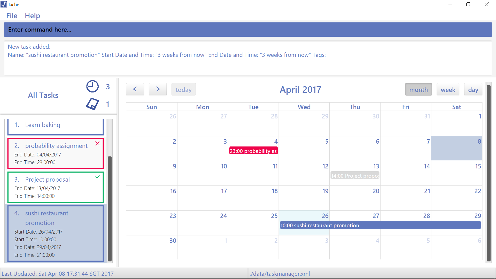
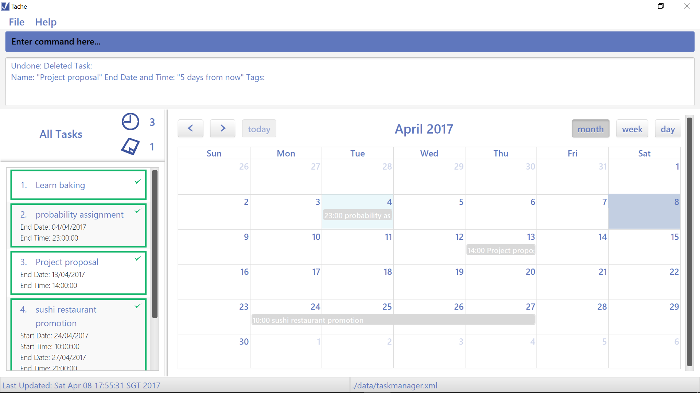
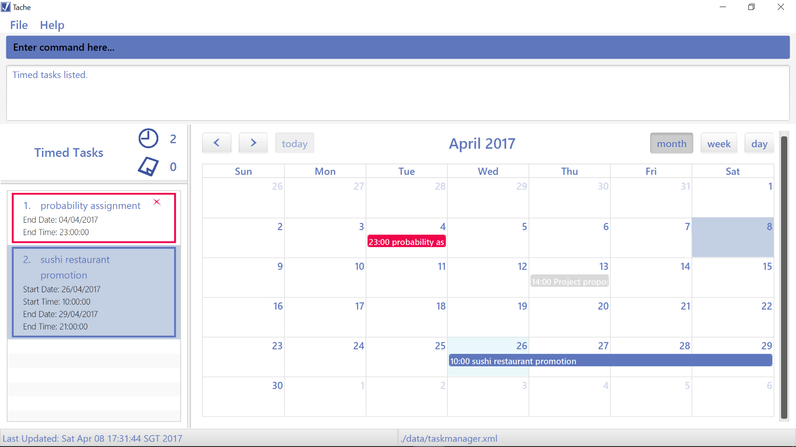
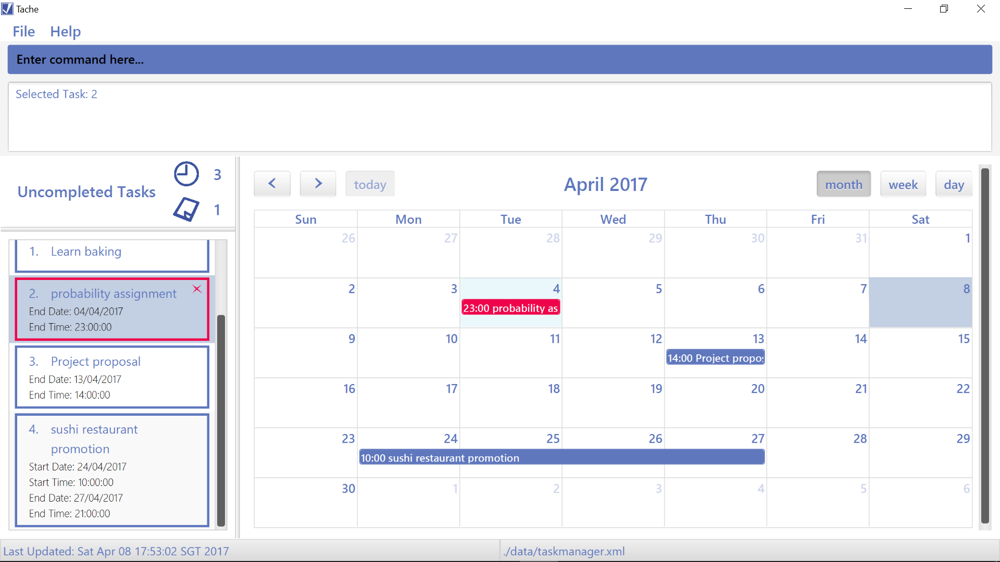

# Tache - User Guide

By : `T09-B4`  &nbsp;&nbsp;&nbsp;&nbsp; Since: `Feb 2017`  &nbsp;&nbsp;&nbsp;&nbsp; Licence: `MIT`

---

## Contents

1. [Introduction](#1-introduction)
2. [Getting Started](#2-getting-started)
3. [Features](#3-features)  
	3.1. [Command Formats](#31-command-formats)  
	3.2. [Adding Tasks](#32-add-a-task--add)  
	3.3. [Deleting Tasks](#33-delete-a-task--delete)  
	3.4. [Finding Tasks](#34-find-a-task--find)  
	3.5. [Listing Tasks](#35-list-all-tasks--list)  
    3.6. [Selecting Tasks](#36-select-a-task--select)  
    3.7. [Editing Tasks](#37-edit-a-task--edit)  
    3.8. [Completing Tasks](#38-complete-a-task--complete)  
	3.9. [Getting Help](#39-get-help--help)  
	3.10. [Change Data File Location](#310-change-data-file-location)  
	3.11. [Load Data File From Location](#311-load-data-file-from-location)  
	3.12. [Undo a Change](#312-undo-a-change--undo)  
	3.13. [Exit](#313-exit-the-program--exit)
4. [Command Summary](#4-command-summary)
5. [FAQ](#5-faq-frequently-asked-questions)
6. [Glossary](#6-glossary)

## 1. Introduction

Hi there, and nice to meet you!

My name is Tache, and I am a **task manager application** designed to serve busy people like you.
Have you ever felt stressed having to deal with a hectic schedule and numerous to-do tasks?
I am here to be your _virtual assistant_ and help you to manage all your deadlines and events.  

You are currently reading my user guide, which has been written to help you with:
* `Installing` me
* `Using` me
* `Troubleshooting` me whenever I give you problems (Hopefully I won't!)

Ready? Let's begin!

## 2. Getting Started

0. Ensure that you have Java version `1.8.0_60` or later installed in your computer. 

   > Unfortunately, having any Java 8 version is not enough because I cannot work with earlier versions of Java 8.

1. Download the latest `tache.jar` file from the [releases](../../../releases) tab.
2. Copy the file to the folder you want to use as my home folder.
3. Double-click the file to start me!  

   > My [GUI](#graphical-user-interface-gui) should appear in a few seconds:

    
   _Figure 2.1. My GUI_

4. Type your desired command in my command box and press <kbd>Enter</kbd> to execute it.  

   **Let's Try it Out!**  

   (Do the following steps in order)

   * **`add`** `Finish Progress Report; 030217 1159PM`  

     > Adds a task with the following [task details](#task-detail) into your task list:  
     > Name: `Finish Progress Report`  
     > Due Date: `3 Feb 2017`  
     > Due Time: `11.59 p.m.`

   * **`list`**  

     > Lists all your tasks.  
     Your task list should only contain 1 task, which is the task you added in the previous step (i.e. `Finish Progress Report`).

   * **`delete`** `Finish Progress Report`  

     > Deletes your task with the name `Finish Progress Report`.

   * **`list`**  

     > Your task list should be empty now.

   * **`exit`**

     > Time for me to rest!

6. Want more? Refer to the [Features](#3-features) section below to find out more about each command I can perform.  

## 3. Features

### 3.1. Command Formats

When typing in your commands, do take note of the following specifications:  

* Times must be specified in _am_ and/or _pm_.
* Dates must be specified in _DDMMYY_ format.
* Either date or time but not both can be left out in the <... date and time> task details.

  > i.e.
  > * `<start date and time>`  
  > * `<due date and time>`  
  > * `<end date and time>`  

* `<task>` refers to the name of your task.

* `<task_index>` refers to the task's index number.

* [Task details](#task detail) for your tasks include the following:

  > * Name
  > * Start_Date
  > * Start_Time
  > * End_Date
  > * End_Time

* The default delimiter between different task details is ";".

* [Filters](#filter) for your tasks include the following:

  > * All
  > * Completed
  > * Uncompleted
  > * Floating
  > * Timed

### 3.2. Add a task : `add`

Adds a task to your task list.  

> Type your [task details](#task-detail) in their respective orders.  
E.g. If you are adding a task with a deadline as in **`add`** `<task>; <due date and time>`,
make sure that you indicate `<task>` before `<due date and time>`, not the other way round!

#### Add a _floating_ task:

A floating task is a task that _does not have any specific times_.  
You are probably not sure when you are going to do it, nor are you sure when exactly it is due.  

Here are some examples of floating tasks:  

> Note: This list is not exhaustive!

* **Hobby-related activities or long-term goals**

  > You just want to record these tasks somewhere so that you can get to them when you are free someday.  

  **_E.g. Learn to bake_**

* **New tasks which cannot be performed _yet_**

  **_E.g. Schedule meet-up with Jamie_**  
  Your friend Jamie might be overseas and uncontactable for now, so you will have to wait for
  her to return to the country in order to schedule the meet-up.

 * **New tasks which do not have a confirmed deadline**

   > It is too early to know when you have to perform these tasks by.  

   **_E.g. Watch La La Land in the theatres_**  
   You might not know when the movie "La La Land" will stop showing in the theatres. It seems to
   be very popular and hence, many theatres might offer showtimes for it for an extended period
   of time.

Format: **`add`** `<task>`  

 
_Figure 3.2.1. Add Command_

#### Add a _timed_ task:

A timed task is a task that _is associated to specific dates and times_.  
It can be a task with a deadline or an event.  

Format: **`add`** `<task>; <due date and time>`  
E.g. **`add`** `project proposal; 041216 2pm` 

Format: **`add`** `<task>; <start date and time>; <end date and time>`  
E.g. **`add`** `sushi restaurant promotion; 040117 10am; 110117 9pm` 

### 3.3. Delete a task : `delete`

Removes a specified task from your task list. 

Here are some examples of tasks that you might want to _delete_ from your task list:

* **Tasks that no longer need to be done**  

  E.g. **_Do financial report_**  
  Your supervisor had delegated the wrong task to you and just corrected his mistake.

* **Tasks that have already been completed by you**  

  E.g. **_Visit the dentist_**  
  You have just visited your dentist last week and have not scheduled your next appointment.

Format: **`delete`** `<task>`  

 
_Figure 3.3.1. Delete Command_

Format: **`delete /all`**  
This command will direct me to clear your _entire task list and delete history_.  
Do think twice before instructing me to do so!

### 3.4. Find a task : `find`

Finds your task(s) whose name(s) contain the keyword or sequence of keywords `<task>`.  

> For example, **`find`** `<home>` can help you search for a task named `do homework`.  

Here are some reasons why you might want to _find_ a task or some tasks:

* **You want to know the [task details](#task-detail) of a task**  

  > Such task details include the duration of a task, the deadline of a task etc.

  E.g. **Finding out when your _project proposal_ is due**  
  You want to plan your schedule for the week, taking into account the proposal deadline.

* **You want to obtain a list of common tasks**  

  > Some tasks might have overlapping words / phrases in their names.

  E.g. **Finding the tasks that contain the word _buy_**  
  You are going to the mall and wish to clear some items on your grocery list.

Format: **`find`** `<task>`  
I will show you the tasks from your search in my right panel as shown
in the following diagram.

 
_Figure 3.4.1. Find Command_

Format: **`find`** `<task>; <due date>`  
E.g. **`find`** `project proposal; 041216`  

This command shows:
* Your tasks that are due by `<due date>`
* Your [floating tasks](#add-a-floating-task)

### 3.5. List all tasks : `list`

Displays tasks in your task list. 

With this command, you will be able to list tasks that have specific statuses or dates and/or times in a _chronological order_.

Here are some reasons why you might want to _list_ your tasks:

* **You want to prioritize your tasks based on the order of their specific dates / times**  

  > You want to have an overview of all your tasks based on how urgent they are, then
  manually select some of these tasks to focus on.

* **You want to track the tasks that you have already completed**  

* **You want to plan your time to get your remaining tasks done**  

* **You want to schedule some of your uncompleted [floating tasks](#add-a-floating-task)**  

  > Converting your floating tasks into [timed tasks](#add-a-timed-task) will allow me to keep track of
  them more effectively (e.g. by alerting you when they are overdue).
  > Fun fact: you can know the _no. of floating and timed tasks_ you have instantly through my
  [GUI](#graphical-user-interface-gui)!

	 
	_Figure 3.5.2. Task Count_

Format: **`list`**  
This lists all tasks. Navigate through the panels and tasks using the arrow keys on your keyboard.  

Format: **`list`** `<filter>` 
E.g. **`list`** `uncompleted`, **`list`** `completed`, **`list`** `floating`, **`list`** `timed`  

 
_Figure 3.5.2. List Command_

### 3.6. Select a task : `select`

Selects a task for you to view its details.  

Here are some reasons why you might want to _select_ a task:

* **You want to know the [task details](#task-detail) of a certain task**  

  > You can refer to the earlier section on the [find](#34-find-a-task--find) command.

* **You want to edit the [task details](#task-detail) of a certain task**  

  > You can refer to the later section on the [update](#37-update-a-task--update) command.

Format: **`select`** `<task>`  

 
_Figure 3.6.1. Select Command_

> If you have _multiple tasks with the same name_, this command will instruct me to display all
those tasks for you. You will then have to choose one of those displayed tasks manually by navigating
to your desired task using your arrow keys, then pressing <kbd>Enter</kbd>.  

### 3.7. Edit a task : `edit`

Edits 1 or more [task details](#task-detail) of a task.  

Here are some examples of tasks which you might want to _edit_:  

* **Tasks that have already exceeded their deadline**

  > You still want to complete a certain task, but you intend to postpone its deadline.  

  **_E.g. Buy aunt's birthday present_**  
  You have unfortunately already missed her birthday, but you still want to give her a
  belated birthday present the next time you meet her.

* **[Floating tasks](#floating-task) that now have known dates / times**

  > You can now add in additional task details for these tasks that were previously floating tasks.

  **_E.g. Schedule meet-up with Jamie_**  
  Your friend Jamie has come back from her overseas trip, and has finally arranged a meet-up with
  you!

Format: **`edit`** `<task_index>; <task_detail> <new_value>`  
This command will direct me to make the specified update to a task with `<task_index>`.  
Format: **`edit`** `<task_index>; <task_detail_1> <new_value1>; <task_detail_2> <new_value2>; ...` 
You can edit more task details for your task concurrently using the following format 
E.g. **`edit`** `1; start_time 3pm; end_time 8pm;`  

 
_Figure 3.7.1. Edit Command_

### 3.8. Complete a task : `complete`

Set a task as completed.  
I will keep your completed tasks hidden until you need to refer to them again.  

Here is a reason why you might want to _complete_ a task:

* **Tasks have already been completed**  

  > You finished a task and do not want it to show up in the default task list anymore.

Format: **`complete`** `<task_index>` 
E.g. **`complete`** `1`  
Format: **`complete`** `<task_index1>,<task_index2>,<task_index3>,...` 
You can complete multiple tasks simultaneously using the following format 
E.g. **`complete`** `1,3,4`  

 
_Figure 3.8.1. Complete Command_

### 3.9. Get help : `help`

Shows a list of all commands I can execute and their usage instructions.  

Format: **`help`** `<command>`  
This command will instruct me to provide you specific information on how to use `<command>`.

Format: **`help /all`**  
This command will help to direct you back to this user guide.

> Help will also be shown if you enter an incorrect command! e.g. `abcd`

### 3.10. Change data file location

Modifies the file path of my data file.  

Here is a reason why you might want to _change my data file location_:

* **You want to [sync](#sync) my task list and access it from other devices**  

  > You can choose to store my data file in a local folder controlled by a cloud
  syncing device (e.g. Dropbox) so that you can access my data from multiple computers.

Format: **`save`** `<new_save_location_directory>`  
This command directs me to set my new data file in a `<new_save_location_directory>`,
then save all my data in that file.

 
_Figure 3.10.1. Save Command_

### 3.11. Load data file from location

Loads the specified data file in Tache.  

The current data file became corrupted out of the blue. Luckily, you've made a backup copy previously.
Now you'll need me to load from that backup copy instead.

Format: **`load`** `<file_path>`  
This command loads the data from the specified file in the `<file_path>`.

### 3.12. Undo a change : `undo`

Undoes the last change made to my data.  

Here are some reasons why you might want to _undo_ a previous command:

* **You accidentally deleted a very important task**  

  > You might not be able to add the task back if you do not remember its details.

* **You edited the wrong details of a task by mistake**  

  > It is a hassle for you to manually correct the details of this task again.

Format: **`undo`**  
I'll undo the last change you made to your tasks.  
I can't remember anything before a **`delete /all`** though.

 
_Figure 3.12.1. Undo Command_

### 3.13. Exit the program : `exit`

Saves all data and exits the program.  
Time for you to actually perform your tasks!

Format: **`exit`**  

## 4. Command Summary

Here is a cheat sheet of what I can do.  
Your wish is my command!

| **Command** | **Usage**                                   | **Example**                                        |
|:-----------:|:-------------------------------------------:|:--------------------------------------------------:|
|Add          |**`add`** `<task>; <due date and time>`      |**`add`** `project proposal; 041216 2pm`            |
|Delete       |**`delete`** `<task>`                        |**`delete`** `watch tv with the children`           |
|Find         |**`find`** `<task>`                          |**`find`** `project`                                |
|List         |**`list`** `<optional filter>`               |**`list`** `uncompleted`                            |
|Select       |**`select`** `<task>`                        |**`select`** `presentation`                         |
|Edit         |**`edit`** `<task_index>; <task_detail> <new_value>;` |**`edit`** `1; name buy white bread;`        |
|Complete     |**`complete`** `<task_index>`                |**`complete`** `1`                                  |
|Help         |**`help`**                                   |                                                    |
|Save         |**`save`** `<directory>`                     |**`save`** `C:\Users\Jim\Desktop`                   |
|Load         |**`load`** `<file_path>`                     |**`load`** `C:\Users\Jim\Desktop\taskmanager.xml`   |
|Exit         |**`exit`**                                   |                                                    |

## 5. FAQ (Frequently Asked Questions)

Here are some questions that you might want to ask me:

**Q**: How do I _transfer my data_ to another computer?  
**A**: Install me in the other computer and _overwrite the empty data file_ I create with
       the file that contains the data of your previous Task Manager folder. Alternatively,
       you can type in **`load`** `<file_path>`, to load your data file.

**Q**: How do I add an _event_?  
**A**: Type in **`add`** `<task>; <start date and time>; <end date and time>` as mentioned
[here](#add-an-event).

## 6. Glossary

#### Graphical User Interface (GUI):

> The graphical interface that allows the you to interact with me through graphical icons and visual indicators

#### Task Detail:

> Detail associated with a task of yours (e.g. duration, name, start time)

#### Sync:

> Ensure that data files in two or more locations are updated
