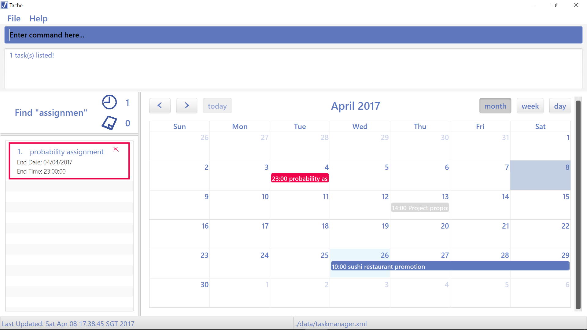
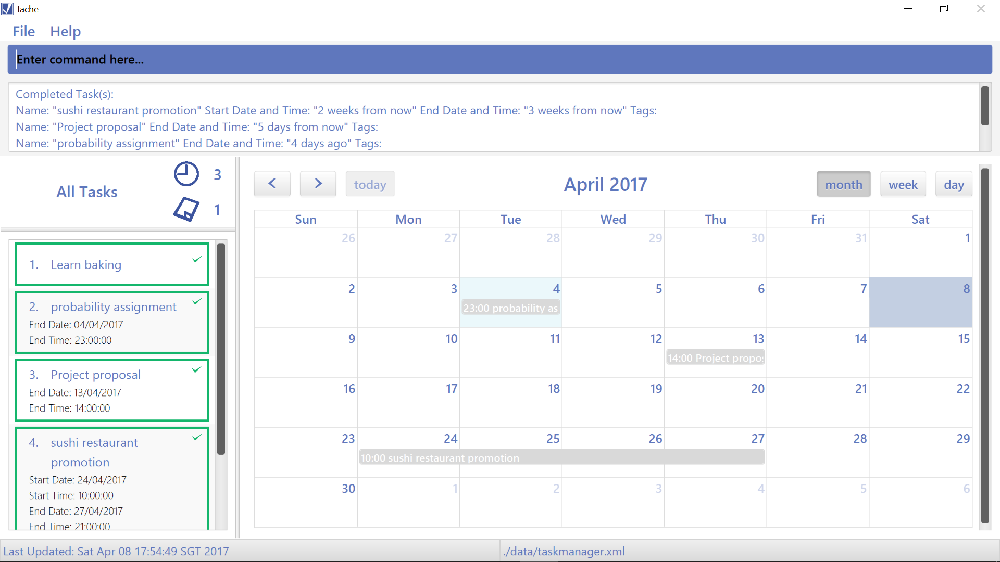
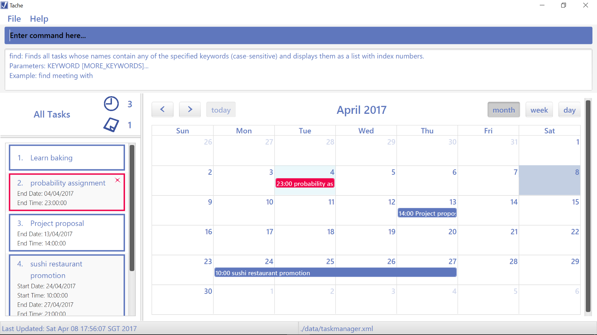
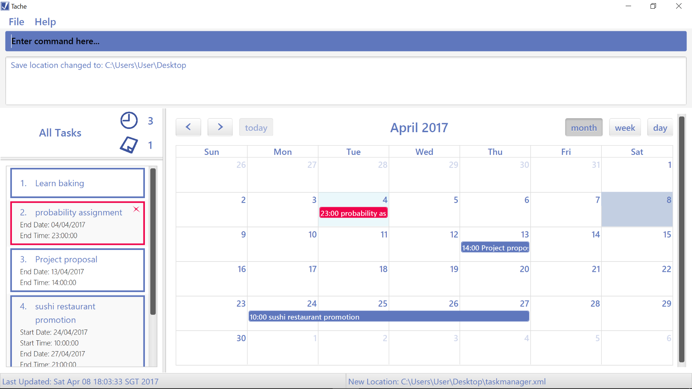
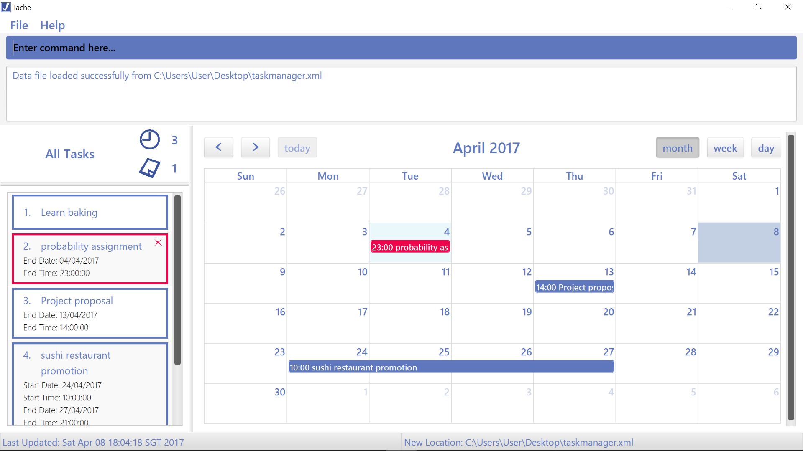

# Tache - User Guide

By : `T09-B4` [Github](https://github.com/CS2103JAN2017-T09-B4/main)  &nbsp;&nbsp;&nbsp;&nbsp; Since: `Feb 2017`  &nbsp;&nbsp;&nbsp;&nbsp; Licence: `MIT`

---

## Contents

1. [Introduction](#1-introduction)
2. [Getting Started](#2-getting-started)
3. [Features](#3-features)  
	3.1. [Terminology](#31-terminology)  
	3.2. [Adding Tasks](#32-add-a-task--add)  
	3.3. [Listing Tasks](#33-list-all-tasks--list)  
	3.4. [Finding Tasks](#34-find-a-task--find)  
	3.5. [Editing Tasks](#35-edit-a-task--edit)  
    3.6. [Deleting Tasks](#36-delete-a-task--delete)  
    3.7. [Selecting Tasks](#37-select-a-task--select)  
    3.8. [Completing Tasks](#38-complete-a-task--complete)  
	3.9. [Undoing a Change](#39-undo-a-change--undo)  
	3.10. [Navigating the Calendar](#310-navigate-the-calendar)  
	3.11. [Getting Help](#311-get-help--help)  
	3.12. [Changing Data File Location](#312-change-data-file-location)  
	3.13. [Loading Data File From Location](#313-load-data-file-from-location)  
	3.14. [Exiting](#314-exit-the-program--exit)
4. [Command Summary](#4-command-summary)
5. [FAQ](#5-faq-frequently-asked-questions)

## 1. Introduction

Hi there, and nice to meet you!

My name is Tache, and I am a **task manager application** designed to serve busy people like you.
Have you ever felt stressed having to deal with a hectic schedule and numerous to-do tasks?
I am here to be your _virtual assistant_ and help you to manage all your deadlines and events.  

You are currently reading my user guide, which has been written to help you with:
* `Installing` me
* `Using` me
* `Troubleshooting` me

## 2. Getting Started

0. Ensure that you have Java version `1.8.0_60` or later installed in your computer. 

   > Unfortunately, having any Java 8 version is not enough because I cannot work with earlier versions of Java 8.

1. Download the latest `tache.jar` file from the [releases](../../../releases) tab.
2. Copy the file to the folder you want to use as my home folder.
3. Double-click the file to start me!  

   > My Graphical User Interface (GUI) should appear in a few seconds:

    
   _Figure 2.1. My GUI_

4. Type your desired command in my command box and press <kbd>Enter</kbd> to execute it.  

   **Let's Try it Out!**  

   (Do the following steps in order)

   * **`add`** `Finish Progress Report by 13 apr 2pm`  

     > Adds a task with the following task details into your task list:  
     > Name: `Finish Progress Report`  
     > Due Date: `13 Apr`  
     > Due Time: `2 p.m.`

   * **`list`**  

     > Lists all your tasks.  
     Your task list should only contain 1 task, which is the task you added in the previous step (i.e. `Finish Progress Report`).

   * **`delete`** `1`  

     > Deletes your task `Finish Progress Report` with the task index `1`.

   * **`list`**  

     > Your task list should be empty now.

   * **`exit`**

     > Time for me to rest!

6. Want more? Refer to the [Features](#3-features) section below to find out more about each command I can perform.  

## 3. Features

### 3.1. Terminology

#### Task Details:

  > * Name
  > * Start Date
  > * Start Time
  > * End Date
  > * End Time

#### Task Filters:

  > * All
  > * Completed
  > * Uncompleted
  > * Floating
  > * Timed

### 3.2. Add a task : `add`

Adds a task to your task list.  

#### To add a _floating_ task:

A floating task is a task that _does not have any specific times_.  
You are probably not sure when you are going to do it, nor are you sure when exactly it is due.  

An example of a floating task:  

* **A hobby-related activity or long-term goal**

  > You just want to record this task somewhere so that you can get to it when you are free someday.  

  **_E.g. Learn baking_**

Format: **`add`** `<task_name>`  

#### To add a _timed_ task:

A timed task is a task that _is associated with specific dates and times_.  
It can be a task with a deadline or an event.  

Format: **`add`** `<task_name> by <due date and time>`  
E.g. **`add`** `project proposal by 13 apr 2pm` 

Format: **`add`** `<task_name> from <start date and time> to <end date and time>`  
E.g. **`add`** `sushi restaurant promotion from 25 apr 10am to 28 apr 9pm` 

 
_Figure 3.2.1. Add Command_

For advanced users: **`a`** `<task_name>`  

### 3.3. List all tasks : `list`

Displays tasks in your task list. 
With this command, you will be able to list tasks of specific statuses in a _chronological order_. 

Some reasons why you might want to _list_ your tasks:

* **You want to prioritize your tasks based on the order of their specific dates / times**  

  > You want to have an overview of all your tasks based on how urgent they are, then
  manually select some of these tasks to focus on.

* **You want to track the tasks that you have already completed**  

* **You want to plan your time to get your remaining tasks done**  

* **You want to schedule some of your uncompleted [floating tasks](#to-add-a-floating-task)**  

  > Converting your floating tasks into [timed tasks](#to-add-a-timed-task) will allow me to keep track of
  them more effectively (e.g. by alerting you when they are overdue).
  > Fun fact: you can know the _no. of floating and timed tasks_ you have instantly through my GUI!

	 
	_Figure 3.3.1. Task Count_

Format: **`list`**  
This lists all your uncompleted tasks.  

Format: **`list`** `<filter>` 
E.g. **`list`** `completed`, **`list`** `all`, **`list`** `floating`, **`list`** `timed`  

 
_Figure 3.3.2. List Command_

For advanced users: **`l`** `<filter>`  

### 3.4. Find a task : `find`

Finds uncompleted and overdue task(s) whose name(s) contain `<keyword>` with one margin of error.  

> For example, **`find`** `<homwork>` can help you search for a task named `do probability homework`.
> Similarly, a task named `programming hoework` (notice the spelling error), will also be found. 

A reason why you might want to _find_ a task:

* **You want to know the [task details](#task-details) of a task**  

  > Such task details include the duration of a task, the deadline of a task etc.

  E.g. **Finding out when your _project proposal_ is due**  
  You want to plan your schedule for the week, taking into account the proposal deadline.

Format: **`find`** `<keyword>`  

 
_Figure 3.4.1. Find Command_

For advanced users: **`f`** `<keyword>`  

### 3.5. Edit a task : `edit`

Edits 1 or more [task details](#task-details) of a task.  

An example of a task you might want to _edit_:  

* **A task that has already exceeded its deadline**

  > You still want to complete a certain task, but you intend to postpone its deadline.  

  **_E.g. Buy aunt's birthday present_**  
  You have unfortunately already missed her birthday, but you still want to give her a
  belated birthday present the next time you meet her.

Format: **`edit`** `<task_index> change <task_detail> to <new_value>`  
This command will direct me to make the specified update to a task with `<task_index>`.  
Format: **`edit`** `<task_index> change <task_detail_1> to <new_value1> and <task_detail_2> to <new_value2> and ...` 
You can edit more task details for your task concurrently using the following format: 
E.g. **`edit`** `4 change start_date to 24 apr and end_date to 27 apr`  

 
_Figure 3.5.1. Edit Command_

For advanced users: **`e`** `<task_index> change <task_detail_1> to <new_value1> and <task_detail_2> to <new_value2> and ...`  
alternatively  
For advanced users: **`e`** `<task_index>; <task_detail_1> <new_value_1>; <task_detail_2> <new_value_2>; ...`  

### 3.6. Delete a task : `delete`

Removes a specified task from your task list. 

An example of a task that you might want to _delete_:

* **A tasks that no longer needs to be done**  

  E.g. **_Do financial report_**  
  Your supervisor had delegated the wrong task to you and has just corrected his mistake.

Format: **`delete`** `<task_index>`  
To delete all your tasks, you can type in **`clear`** instead.  

For advanced users: **`d`** `<task_index>`  

### 3.7. Select a task : `select`

Selects a task for you to see it at the calendar view.  

A reason why you might want to _select_ a task:

* **You want to view your task in relation to the other tasks you have for the month**  

  > This will guide you in planning your schedule for the next few weeks.  

Format: **`select`** `<task_index>`  

 
_Figure 3.7.1. Select Command_

For advanced users: **`s`** `<task_index>`  

### 3.8. Complete a task : `complete`

Marks a task as done.  

A reason why you might want to _complete_ a task:

* **You want to declutter your task list**  

  > I will keep your completed tasks hidden from your default list view until you need to refer to them again.  

Format: **`complete`** `<task_index>` 
E.g. **`complete`** `1`  
Format: **`complete`** `<task_index1>,<task_index2>,<task_index3>,...` 
You can complete multiple tasks simultaneously using the following format: 
E.g. **`complete`** `1,2,3,4`  

 
_Figure 3.8.1. Complete Command_

For advanced users: **`c`** `<task_index>`  

### 3.9. Undo a change : `undo`

Undoes the last change made to my data.  

A reason why you might want to _undo_ a previous command:

* **You edited the wrong details of a task by mistake**  

  > It is too much of a hassle for you to manually correct your error by editing the task again.

Format: **`undo`**  

 
_Figure 3.9.1. Undo Command_

For advanced users: **`u`**  

### 3.10. Navigate the Calendar:

Replaces navigation buttons on the calendar with user commands.  

 
_Figure 3.10.1. Calendar_

* _< button_ : **`prev`**  
* _> button_ : **`next`**  
* _day button_: **`show day`**  
* _week button_: **`show week`**  
* _month button_: **`show month`**  

For advanced users: **`p`**, **`n`**, **`s`** `<view>`  

### 3.12. Get help : `help`

Shows a list of all commands I can execute and their usage instructions.  

Format: **`help`**  
This command will help to direct you back to this user guide.

Format: **`help`** `<command>`  
This command will instruct me to provide you specific information on how to use `<command>`.

 
_Figure 3.12.1. Help Command_

For advanced users: **`h`** `<command>`  

### 3.13. Change data file location

Modifies the file path of my data file.  
Future modifications of my task list will be saved at this new location.  

A reason why you might want to _change my data file location_:

* **You want to [sync](#sync) my task list and access it from other devices**  

  > You can choose to store my data file in a local folder controlled by a cloud
  syncing device (e.g. Dropbox) so that you can access my data from multiple computers.

Format: **`save`** `<new_save_location_directory>`  
This command directs me to set my new data file in a `<new_save_location_directory>`,
then save all my data in that file.

 
_Figure 3.13.1. Save Command_

### 3.14. Load data file from location

Loads the specified data file.  

Here is a reason why you might want to _load a data file_:

* **Your current data file is corrupted**  

  > Luckily, you've made a backup copy previously. Now you'll need me to load from that backup copy instead.  

Format: **`load`** `<file_path>`  
This command loads the data from the specified file in the `<file_path>`.

 
_Figure 3.14.1. Load Command_

### 3.15. Exit the program : `exit`

Saves all data and exits the program.  
Time for you to actually perform your tasks!

Format: **`exit`**  

## 4. Command Summary

Here is a cheat sheet of what I can do.  
Your wish is my command!

| **Command** | **Usage**                                                     | **Example**                                         |
|:-----------:|:-------------------------------------------------------------:|:---------------------------------------------------:|
|Add          |**`add`** `<task_name> by <due date and time>`                 |**`add`** `project proposal by 13 apr 2pm`           |
|List         |**`list`** `<optional filter>`                                 |**`list`** `uncompleted`                             |
|Find         |**`find`** `<keyword>`                                         |**`find`** `prject`                                  |
|Edit         |**`edit`** `<task_index> change <task_detail> to <new_value>;` |**`edit`** `1; change name to buy white bread`      |
|Delete       |**`delete`** `<task_index>`                                    |**`delete`** `1`                                     |
|Select       |**`select`** `<task_index>`                                    |**`select`** `2`                                     |
|Complete     |**`complete`** `<task_index>`                                  |**`complete`** `1`                                   |
|Undo         |**`undo`**                                                     |                                                     |
|Prev         |**`prev`**                                                     |                                                     |
|Next         |**`next`**                                                     |                                                     |
|View         |**`view`**                                                     |**`view`** `day`                                     |
|Help         |**`help`**                                                     |**`help`** `find`                                    |
|Save         |**`save`** `<directory>`                                       |**`save`** `C:\Users\Jim\Desktop`                    |
|Load         |**`load`** `<file_path>`                                       |**`load`** `C:\Users\Jim\Desktop\taskmanager.xml`    |
|Exit         |**`exit`**                                                     |                                                     |

## 5. FAQ (Frequently Asked Questions)

Here are some questions that you might want to ask me:

**Q**: How do I _transfer my data_ to another computer?  
**A**: Install me in the other computer and _overwrite the empty data file_ I create with
       the file that contains the data of your previous Task Manager folder. Alternatively,
       you can type in **`load`** `<file_path>`, to load your data file.

**Q**: How do I add an _event_?  
**A**: Type in **`add`** `<task> from <start date and time> to <end date and time>` as mentioned
[here](#32-add-a-task--add).

**Q**: How do I retrieve my _previous commands_?  
**A**: Use the arrow keys <kbd>Up</kbd> and <kbd>Down</kbd> to get your previous commands.

**Q**: Is there any way I can _type my commands faster_?  
**A**: Yes, I _autocomplete_ all commands. Every command can also be replaced with the first letter of
its name. For example, you can replace "add" with just "a".
