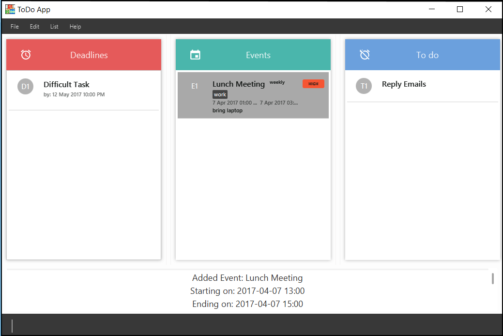
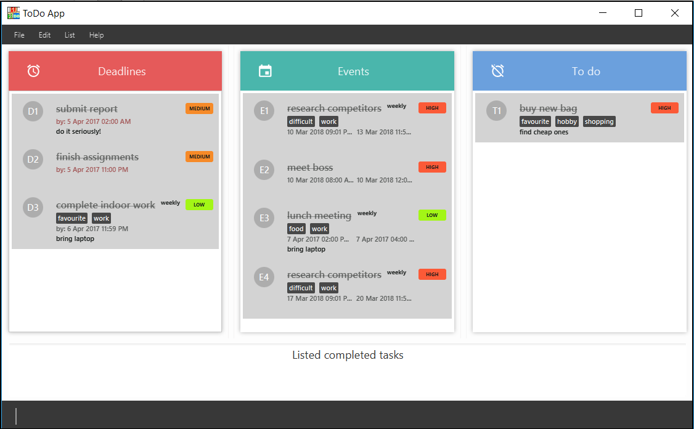
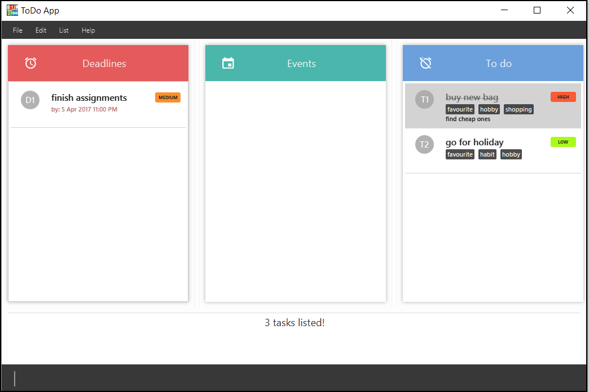

# User Guide

- [About](#about)
- [Getting Started](#getting-started)
- [Features](#features)
- [Commands](#commands)
- [Command Format](#command-format)
- [Cheat Sheet](#cheat-sheet)
- [FAQ](#faq)

## About

Having trouble keeping track of the tasks you need to do? Looking for a simple yet effective task manager to help you organise your day? OneTwoDo is what you need!

OneTwoDo helps you to manage your events, deadlines, and other to-do tasks so that you can spend more time completing tasks instead of managing them.

OneTwoDo has a simple and clean interface, so that with one glance you can have a clear idea of your tasks at hand.

OneTwoDo is designed to be keyboard-friendly. By simply typing commands in one line of text, OneTwoDo will faithfully execute your wish. You do not need to worry about clicking multiple buttons or links.

OneTwoDo is also extremely flexible. It is smart enough to understand various command formats and shortcuts.

Get started with OneTwoDo today!

## Getting Started

Before using OneTwoDo, please ensure that you have installed **Java version 1.8.0_60** or later as the application does not work with earlier Java 8 versions.

Start your OneTwoDo journey by downloading the latest **OneTwoDo.jar** from the releases tab. Download OneTwoDo directly into the home folder you want to use for the app.

You can start OneTwoDo by simply double-clicking the icon!
   > 

*Figure 1: OneTwoDo User Icon*

Congratulations, you are all set up!

## Features

After you have started OneTwoDo, you will see our welcome screen. With one glance, you can view all your tasks for the day.

*Figure 2: Welcome Screen*

You can now proceed to add or modify your tasks in OneTwoDo's main User Interface.

*Figure 3: OneTwoDo User Interface*

You will see the following sections in our User Interface:

1. **Command box**
    - Enter a command into this box and press enter to execute the command.
    - You can press the <kbd>&uarr;</kbd> or <kbd>&darr;</kbd> arrow keys to fill the command box with previously executed commands.
2. **Result summary and tips**
    - A summary of the result of the executed command is shown to give feedback about the effects of the command.
3. **Task panels**
    - Each panel displays your tasks depending on the category they belong to. 
    - You can press <kbd>SHIFT</kbd>+<kbd>&uarr;</kbd> or <kbd>SHIFT</kbd>+<kbd>&darr;</kbd> to scroll up or down the task panels respectively, without using your mouse!

Your tasks are separated into 3 categories:

1. `Deadline` - This panel displays tasks with an end date but no start date.
2. `Event` - This panel displays tasks with a start date and an end date.
3. `To-do` - This panel displays tasks with neither a start date nor an end date.

## Commands

Let us assume that you are a busy professional. The following scenarios illustrate how you could use the commands in OneTwoDo, although these  examples could very well be applied to anyone who wants to better manage their tasks with OneTwoDo. 

### Viewing command summary : `help`
You want to start using OneTwoDo to organize your meetings and projects more efficiently. However, being new to this application, you may need some guidance. Do not worry, simply type `help` and a concise command summary window will pop up to clear your confusion.

    >>  help

*Figure 3: Command Summary Window*

After viewing the command summary, you may want to find out more about the special features and commands offered by OneTwoDo. Try entering the command `help ug` or `help userguide` and our informative user guide will open up for you to explore.

    >>  help ug
    >>  help userguide
    
> - You can press the <kbd>&uarr;</kbd> or <kbd>&darr;</kbd> arrow keys to scroll up or down the window without using your mouse!
> - Simply type any other key to close the popup window.

---
### Adding a task: `add`

As a professional, you have an overwhelming number of emails to reply to whenever you are free. Add this to-do task into OneTwoDo so you will not forget!

    >>  add Reply Emails 

Figure 8: Add a to-do

Sometimes, your manager issues you an important task with a strict deadline. Key it into OneTwoDo before you forget! This time, indicate the task's deadline as well.

    >>  add Difficult Task  e/12-May-2017 10pm

Your manager emails you that there will be an important lunch meeting from 1-3pm tomorrow. Key it into OneTwoDo, but this time, also indicating the duration. You can choose to input more detailed information related to any task as well.

    >>  add Lunch Meeting  s/tmr 1pm  e/tmr 3pm

    >>  add Lunch Meeting  s/tmr 1pm  e/tmr 3pm  r/weekly  d/bring laptop  p/high  t/work

*Figure 4: Add event task with detailed info*

#### Format

`add NAME [s/START_DATE] [e/END_DATE] [r/RECUR] [d/DESCRIPTION] [p/PRIORITY] [t/TAG]...`

Refer to the [Command Format](#command-format) section below if you do not understand the command format.

> - `s/` refers to the starting date / time.
> - `e/` refers to the ending date / time.
> - `r/` refers to the recurring period of the task. It can be `daily`, `weekly`, `monthly` or `yearly`
> - `d/` refers to the description of the task.
> - `p/` refers to the priority level of the task. It can be `high` (`h`), `medium` (`m`) or `low` (`l`).
> - `t/` refers to the task's tag. A task can have any number of tags.

---
### Editing a task : `edit`

Your manager has just postponed the meeting to tomorrow, 2-4pm. Simply use the `edit` command to update your task!

    >>  edit  e1  s/tmr 2pm  e/tmr 4pm

The command above will edit your task at the specified `PREFIX_INDEX` `e1`. The `edit` command allows you to edit any field of your task easily.

When editing tags, all existing tags of the task that were set previously will be replaced. You can remove all the tags of a task by typing `t/` without specifying any tags after it.

    >>  edit  e1  t/

*Figure 5: Before and after tags removal*

#### Format
`edit PREFIX_INDEX [NAME] [s/START_DATE] [e/END_DATE] [r/RECUR] [d/DESCRIPTION] [p/PRIORITY] [t/TAG]...`

Refer to the [Command Format](#command-format) section below if you do not understand the command format.

---
### Listing tasks : `list`

Having so many tasks you need a way to display only the tasks that you need to see. The `list` command lets you view tasks according to your specified criteria, allowing you to filter and sort them to your liking.

  
    >>  list  s/today  e/next week

The above command will filter out all the tasks you need to do from today till next week. However, you might also want compare which tasks are more crucial and hence needs to be completed earlier. This is where changing the order using the option `o/` makes it convenient for you.

    >>  list  o/priority

*Figure 6: Sort by priority*

Sometimes you may be so busy that you have forgotten if you had replied an important email. In times like this when you need to review the tasks you have completed, simply type in:
   
    >>  list  done

All your completed tasks are listed! You may feel a sense of satisfaction after seeing all the tasks you have accomplished, but it looks like you have not replied the email.

*Figure 7: Filter all completed tasks*

#### Format
`list [DONE_STATUS] [s/START_DATE] [e/END_DATE] [o/ORDER] [p/PRIORITY] [t/TAG]...`

Refer to the [Command Format](#command-format) section below if you do not understand the command format.

> - `DONE_STATUS` can be `ALL`, `UNDONE`, or `ALL`.
> - `o/` refers to order that the tasks are sorted by. 
> - You can sort by `priority`, `alphanumeric` and `dateTime`.
> - You can also filter and sort your tasks with multiple parameters. Only tasks that  satisfy the filtering criteria will be shown.
>   * E.g. `list  s/today  e/next week  o/dateTime  p/high  t/work`

---
### Finding all tasks containing a keyword in their name or tag: `find`

Your manager assigns you to research about "bags that people buy on birthdays". Perhaps you have trouble remembering the exact words you added in that task? If you had only remembered the keywords "birthday", "shopping" or "assignment", simply use the find command and any tasks matching those keywords will be listed out for you.

     >>  find birthday shopping assignment

#### Format
`find KEYWORD [MORE_KEYWORDS]...`

>   - Shows a task if any word in its name, description, or tags matches any of the keywords

*Figure 8: Find task*

---
### Selecting a task : `select`

If you want to view a task's description that, use this command. A popup window containing the name and description of task selected will be shown. To view more details about a task with the `PREFIX_INDEX` `e2`, simply type:

    >>  select e2

---
### Marking a task as completed: `done`
Completed an assignment ahead of time? Give yourself a pat on the back, and type `done` to mark the task as completed. This command marks a task at the specified `PREFIX_INDEX` as completed. 

    >>  done t1

---
### Marking a task as uncompleted: `undone`
Somtimes requirements change and you may have realised that a completed task still has parts that are undone. Simply mark that task as undone with this command, which marks a task at the specified `PREFIX_INDEX` as uncompleted.

    >>  undone t1

---
### Deleting a task : `delete`

Your manager had unfortunately assigned you to work overtime, and you cannot make it home in time for your birthday celebration. Type `delete` to remove your celebration plans from OneTwoDo. This command removes the task at the specified `PREFIX_INDEX`.

    >>  delete e2

---
### Undoing actions: `undo`
Did you delete a high priority task by accident? Keep calm, type `undo`, and OneTwoDo will restore that important task! 

    >>  undo

---
### Redoing actions: `redo`
After reversing your actions using `undo`, you realize that it is actually safe to delete. Simply type `redo`, and that not-so-important task will disappear once again from OneTwoDo!

    >>  redo

---
### Saving the data: `save`

By default, your task data is saved in a file named `todolist.xml` in the `data` folder. However, you can change the location and name of the file with this command. Type `save` and the filepath after that. Remember to use the `.xml` file extension at the end of the file name. If a file with the same name already exists, type `overwrite` to replace the existing file.

    >>  save myStorage.xml

    >>  save overwrite myStorage.xml

---
### Exporting the data: `export`

If you want to export your current task data to an `.xml` file, type `export` and the filepath after that. Remember to use the `.xml` file extension at the end of the file name. If a file with the same name already exists, type `overwrite` to replace the existing file.

    >>  export storageName.xml

    >>` export overwrite storageName.xml

---
### Importing the data: `import`

When you want to display data from a saved file, type `import` and filepath after that. Remember to use the `.xml` file extension.

    >>  import storageName.xml

---
### Deleting all tasks: `clear`

You have finally quit your job, but there are so many added task that needs to be deleted. No problem! Simply type `clear` and start your OneTwoDo journey again on a new note!

    >>  clear

___
### Exiting the program : `exit`

After adding all your tasks to OneTwoDo, you want to exit OneTwoDo to actually complete those tasks. Simply type `exit` to close the application.

    >>  exit

___
## Command Format
- Each command corresponds to a  _command word_, which may have _command options_, and both accept _command parameters_ after it.
- A command word is the first word of the command. (e.g. `find`, or `help`).
- A command option specifies additional information needed by the command.
    - It consists of a character followed by a forward slash (e.g. `s/`, `t/`, etc), followed by data to be specified after the forward slash if there are any. (e.g. `s/tomorrow 0900`). 
    - The order of options is not fixed after the task name. (e.g. executing `add Go home p/high d/after class` is the same as executing `add Go home d/after class p/high`).
    - Options surrounded by square brackets `[ ]` are optional.
    - Options with `...` (ellipses) after them can be specified multiple times (e.g. `t/Schoolwork t/CS2103`).
    - Options with `|` (the pipe symbol) means that either option on the left or right should be used.

- A command parameter is an `UPPER_CASE` word representing required data for a command word or its options. Some common examples include:
    - `NAME`
        * The name of the task.
    - `PREFIX_INDEX`
        * The index number shown in the most recent listing.
        * Comprises of a category prefix (`e`, `d`, or `t`, represents `Event`, `Deadline` and `To-Do` categories respectively) and category index (a positive integer, e.g. `1`, `2`, `3`..).
    - `START_DATE`
        * Date and time when the task starts is entered
        * If no time is indicated, the default time is taken as 0000 hrs.
        * Must be before `END_DATE`.
        * Please refer to the Date and Time Format Specification for the list of accepted formats.
    - `END_DATE`
        * Date and time when the task ends is entered
        * If no time is indicated, the default time is taken as 2359 hrs.
        * Must be after `START_DATE`.
        * Please refer to the Date and Time Format Specification for the list of accepted formats.

### Date and Time Format Specification

OneTwoDo accepts most date and time formats, including:
* 2016/12/31
* 12/31/2016
* 2016-12-31
* Dec 31st
* 31st Dec 2016
* 31st of December
* Next Tue 3pm
* Today 0800
* Tomorrow 5:30am
* Last Wednesday 0600h
* 3 days from now

Refer to [http://natty.joestelmach.com/doc.jsp](http://natty.joestelmach.com/doc.jsp) for a full list of supported formats.
 

---
## Command Summary

| Command       | Format       | Description | Alternatives |
| :-------------|:-------------|:-----------|:-------------|
|  Help         |  `help` | Open help window |F1
|  Help ug         |  `help ug` | Open this userguide | help ug, help userguide
|  Add          |  `add NAME [s/START_DATE] [e/END_DATE] [r/RECUR] [d/DESCRIPTION] [p/PRIORITY] [t/TAG]...` | Add a task| 
|  Edit         |  `edit PREFIX_INDEX [NAME] [s/START_DATE] [e/END_DATE] [r/RECUR] [d/DESCRIPTION] [p/PRIORITY] [t/TAG]...` | Edit any specified task's information|
|  List         |  `list [DONE_STATUS] [s/START_DATE] [e/END_DATE] [o/ORDER] [p/PRIORITY] [t/TAG]...` | List specified tasks in specified order| Ctrl+Shift+D,  Ctrl+Shift+U, Ctrl+Shift+A (list *Done*, *Undone* and *All* respecively)
|  Find         |  `find KEYWORD [MORE_KEYWORDS]...` | Find tasks with keywords|
|  Select         |  `select PREFIX_INDEX` | Select a task to view|
|  Done         |  `done PREFIX_INDEX` | Archive the specified task|
|  Undone       |  `undone PREFIX_INDEX` | Unarchive the specified task|
|  Undo         |  `undo`  | Undo previous action| Ctrl+U
|  Redo         |  `redo` | Redo previous action| Ctrl+R
|  Save         |  `save [overwrite] FILE_PATH` | Save file to specified location|
|  Export         |  `export [overwrite] FILE_PATH` | Export file to specified location|
|  Import         |  `import FILE_PATH` | Import file to be used|
|  Delete       |  `delete PREFIX_INDEX` | Delete specified task |
|  Clear        |  `clear` | Clear all data in OneTwoDo|
|  Exit         |  `exit`  | Quit the program| Ctrl+E

---
## FAQ

**Q**: How do I transfer my data to another computer?  
**A**: Use the `export` command to export out the storage. Transfer the storage file via any means (thumb drive, email, etc) and use the `import` command on another computer to import the storage file.
 
 

**Q**: What type of date and time format can I use?  
**A**: OneTowDo support a variety of formats. You can checkout some of the more common formats above. For complete list of format, checkout the Natty website: http://natty.joestelmach.com/doc.jsp.
 
 

**Q**: How do I save my task data in OneTwoDo?  
**A**: OneTwoDo will save your data automatically every time you execute a command.
 
 

**Q**: What is the difference between `find` and `list` command?  
**A**: The `find` command helps you search for a particular task based on the keywords you remember. The `list` command helps you to filter and sort the tasks in OneTwoDo.
 
 

**Q**: Which commands will I be able to undo?  
**A**: You can only undo the commands that modify the data of OneTwoDo. The 6 commands that you can undo are: `add`, `delete`, `edit`, `clear`, `done`, and `undone`.
 
 

**Q**: What is the difference between the `done` and `delete` command?  
**A**: The `delete` command will remove the selected task from OneTwoDo. The `done` command will archive the selected task into the `done` category. In this way, you can still keep track of the tasks that have been done by using the command `list done`.
