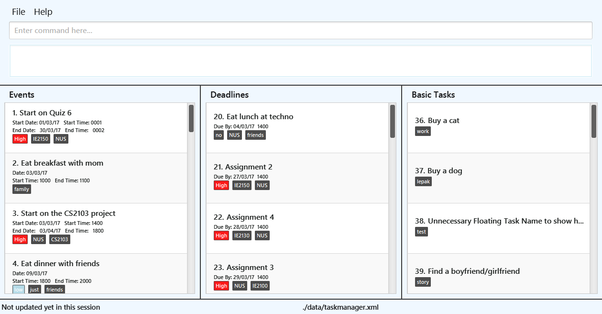
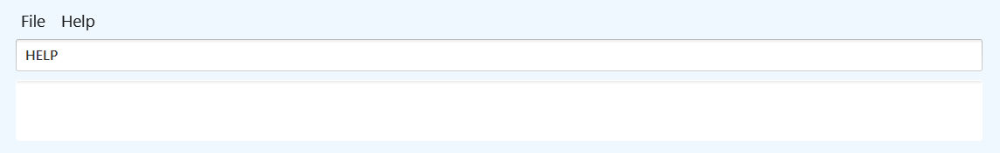
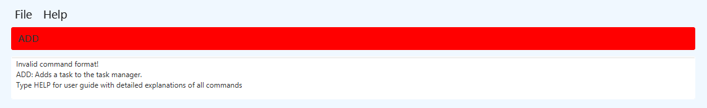

# ProcrastiNomore (Task Manager Application) - User Guide

By : `Team ProcrastiNomore`  &nbsp;&nbsp;&nbsp;&nbsp; Since: `Feb 2017`  &nbsp;&nbsp;&nbsp;&nbsp; Licence: `MIT`

---

1. [Introduction](#1-introduction)
2. [Quick Start](#2-quick-start)
3. [Features](#3-features)
4. [FAQ](#4-faq)
5. [Command Summary](#5-command-summary)

## 1. Introduction

This User Guide will aid you in understanding how ProcrastiNomore operates and what are
the functionalities this application has.

ProcrastiNomore is a single command line task-management application that is able to
store new tasks and edit existing tasks. This application will aid you in organizing
all your corresponding tasks and events.

## 2. Quick Start

1. Please ensure that you have Java version 1.8.0_60 or later install in your Computer. 

   > Having any Java 8 version is not enough. 
   > This app will not work with earlier versions of Java 8.

2. Download the latest `ProcrastiNomore.jar` from the [releases](../../../releases) tab.
3. Copy the file to the folder you want to use as the home folder for your Task Manager.
4. Double-click the file to start the app. The GUI should appear in a few seconds.
   > 

5. Using the application

   >This application works by entering commands via the keyboard. 
   >Type the command in the command box and press <kbd>Enter</kbd> to execute it.  
   >For example, typing **`HELP`** and pressing <kbd>Enter</kbd> in the command box and it will
   open the help window.  
   > 

6. Refer to the [Features](#Features) section below for more details on the various
commands you can use. 

## 3. Features

> **Command Format**
>
> * Words in `UPPER_CASE` are the command words.
> * Command words can be in any order.
> * Items in `SQUARE_BRACKETS` are optional.
> * Items with `...` after them can have multiple instances.

### 3.1. Viewing help : `HELP`

You can use this command to open a help window which will open this user guide page

Format: `HELP`

> Help is also shown if you enter an incorrect command e.g. `ADD`
> 

### 3.2. Adding a new Task: `ADD`

You can use this command to add different types of task in ProcrastiNomore.  
There are 3 forms of task that ProcrastiNomore supports:
> [Events](#321-events)
> * [Same Day Events](3211-same-day-events)
> * [Multiple Days Events](3212-Multiple-days-events)  
> [Deadlines](#322-deadlines)  
> [Basic Tasks](#323-basic-task)

#### 3.2.1. Events

Events added into the task manager are sorted by their start time. Events with earlier start date and time will be located at the top and later start date and time at the bottom of the event tasks pane.

##### 3.2.1.1. Same Day Events
These are events that end within the same day(duration of a day or lesser).  

There are two formats:

Format: `ADD` task `ON` date/day  
> In this format where only a date/day is provided, start and end time will be automatically assigned as:
> * Start Time : 0000hrs
> * End Time   : 2359 hrs 

Format: `ADD` task `ON` date/day time `TO` time  
> In this format, start or end time can be omitted and the fields will be automatically assigned.  
> Without specified start time, it will be automatically assigned as:
> * Start Time : 0000hrs
>
> Without a specified end time, it will be automatically assigned as:
> * End Time   : +1hr buffer from start time   
> eg. Start time 1200hrs, end time will be 1300hrs 
> If one hour buffer goes into the next day, End date will be changed to next day and time will be changed accordingly.

##### 3.2.1.1. Multiple Days Events
Format: `ADD` task `FROM` date/day time `TO` date/day time  
> Same start and end date cannot be used for this format. If a same day event is required, use one day event format.  
> Without specified start or end time, start and/or end time will be automatically assigned as:
> * Start Time : 0000hrs
> * End Time   : 2359 hrs 

Sample Event:
> Type the following command `ADD Stayover with Friends FROM 10/05/17 1400 TO 11/05/16 1800 CATEGORY Fun` into the command Box and press <kbd>Enter</kbd>
> 
> The application will save the sample event in Events column 
> 

#### 3.2.2. Deadlines

Deadlines added into the task manager are sorted by their due date. Events with earlier due date and time will be located at the top and later due date and time at the bottom of the deadline tasks pane.

Format: `ADD` task `BY` date/date time
> Without specified end time, end time will be automatically assigned as:
> * End Time   : 2359 hrs 

Sample Deadline:
> Type the following command `ADD finish project BY 05/05/17 1400` into the command Box and press <kbd>Enter</kbd>
> 
> The application will save the sample deadline in the Deadlines column
> 

#### 3.2.3. Basic Task

Basic tasks added into the task manager are sorted by their entry time. The most recently added basic task will be located at the bottom of the basic tasks pane.

Format: `ADD` task

Sample Basic Task:
> Type the following command `ADD Eat fried chicken` into the command box and press <kbd>Enter</kbd>
> 
> The application will save the sample basic task into the Basic Tasks column
> 

Other examples:

* `ADD` eat breakfast `ON` 03/03/17
* `ADD` eat lunch `ON` thursday
* `ADD` eat dinner `FROM` today 1730 `TO` today 1930
* `ADD` eat breakfast `FROM` tomorrow 0800 `TO` tomorrow 0830
* `ADD` eat lunch `ON` 03/03/17 1400 `TO` 1500
* `ADD` eat dinner `BY` 03/03/17 330
* `ADD` eat breakfast `BY` 0730
* `ADD` eat breakfast

> Upon adding your task, the relevant list will scroll to the newly added task.

#### 3.2.4. Tag tasks with a specific category : `CATEGORY`

While adding/updating tasks it is possible to tag categories to the task to better identify the tasks. 

Format : `ADD` task `ON` date `CATEGORY` categoryName 
&nbsp;&nbsp;&nbsp;&nbsp;&nbsp;&nbsp;&nbsp;&nbsp;&nbsp;&nbsp;&nbsp;&nbsp;`UPDATE` `Task Index` `CATEGORY` categoryName

>Categories added can be identified by the small grey box at the bottom of the task as seen in image below. 
> 

 If user wants more than one category tagged to the task, for example two categories: 
 `ADD` task `FROM` date `TO` date `CATEGORY` categoryOne `CATEGORY` categoryTwo

 ##### Special Categories : High, Medium, Low

 These categories are to show priority and will have a different colour box as compared to normal categories.  
 Priority(Colour): High(Red), Medium(Yellow), Low(Blue)

 >Image showing tasks with different special categories and their respective colours. 
 > 

### 3.3. Update an existing task : `UPDATE`

You can use this command to update existing task in ProcrastiNomore.  
There are 2 types of updates that ProcrastiNomore supports:

#### 3.3.1. Update existing task to a floating task

Format: `UPDATE` `Task Index`
Sample Update task name:
> Type the following command `UPDATE 36 Buy a horse` into the command Box and press <kbd>Enter</kbd>
> 
> The application will update the existing task with task index 36 and change the task name from "Buy a cat" to "Buy a horse"
> 

#### 3.3.2. Update specific fields of an existing task

In this type of update, existing fields of information of tasks will be kept and only the relevant specified fields will be updated. 
It is possible to update a task to a different type of task (eg. from an event to a deadline) 
Command words used work similarly as during adding (ON, FROM, TO, BY)

Some general formats include the following:

General Format: `UPDATE` `Task Index` `New Task Name` - Changes existing task's name to new task name 
&nbsp;&nbsp;&nbsp;&nbsp;&nbsp;&nbsp;&nbsp;&nbsp;&nbsp;&nbsp;&nbsp;&nbsp;&nbsp;&nbsp;&nbsp;&nbsp;&nbsp;&nbsp;&nbsp;&nbsp;&nbsp;&nbsp;&nbsp;&nbsp;&nbsp;&nbsp;`UPDATE` `Task Index` `FROM` date /date time `TO` date /date time - Changes existing task to event with  
&nbsp;&nbsp;&nbsp;&nbsp;&nbsp;&nbsp;&nbsp;&nbsp;&nbsp;&nbsp;&nbsp;&nbsp;&nbsp;&nbsp;&nbsp;&nbsp;&nbsp;&nbsp;&nbsp;&nbsp;&nbsp;&nbsp;&nbsp;&nbsp;&nbsp;&nbsp;specified start and end date/time 
&nbsp;&nbsp;&nbsp;&nbsp;&nbsp;&nbsp;&nbsp;&nbsp;&nbsp;&nbsp;&nbsp;&nbsp;&nbsp;&nbsp;&nbsp;&nbsp;&nbsp;&nbsp;&nbsp;&nbsp;&nbsp;&nbsp;&nbsp;&nbsp;&nbsp;&nbsp;`UPDATE` `Task Index` `BY` date /date time - Changes existing task to deadline with newly specified  
&nbsp;&nbsp;&nbsp;&nbsp;&nbsp;&nbsp;&nbsp;&nbsp;&nbsp;&nbsp;&nbsp;&nbsp;&nbsp;&nbsp;&nbsp;&nbsp;&nbsp;&nbsp;&nbsp;&nbsp;&nbsp;&nbsp;&nbsp;&nbsp;&nbsp;&nbsp;date/time

Sample Update task name:
> Type the following command `UPDATE 36 Buy a horse` into the command Box and press <kbd>Enter</kbd>
> 
> The application will update the existing task with task index 36 and change the task name from "Buy a cat" to "Buy a horse"
> 

Some more specific cases include:

##### Existing deadline
Format: `UPDATE` `Task Index` `FROM` date /date time - Changes existing deadline to event starting from specified date/time to current due time 

##### Existing event
Format: `UPDATE` `Task Index` `FROM` date / time / date time 
> Changes existing event start date/time to specified date/time without changing other fields 
> * When only a date is provided, automatically assign Start Time to be 0000hrs
Format:`UPDATE` `Task Index` `TO` date / time / date time 
> Changes existing event end date/time to specified date/time without changing other fields 
> * When only a date is provided, automatically assign End Time to be 2359hrs 

Sample Update event task time:
> Type the following command `UPDATE 1 TO 0230` into the command Box and press <kbd>Enter</kbd>
> 
> The application will update the existing task with task index 1 and change the task end time from "0002" to "0230"
> 

Examples:
* `UPDATE` `1` eat dinner
* `UPDATE` `1` `FROM` thursday `TO` friday

### 3.4. Delete an existing task: `DELETE`

You can use this command to delete existing task in ProcrastiNomore

Format: `DELETE` `Task Index`  
&nbsp;&nbsp;&nbsp;&nbsp;&nbsp;&nbsp;&nbsp;&nbsp;&nbsp;&nbsp;&nbsp;&nbsp;&nbsp;`DELETE` `Task name`  
&nbsp;&nbsp;&nbsp;&nbsp;&nbsp;&nbsp;&nbsp;&nbsp;&nbsp;&nbsp;&nbsp;&nbsp;&nbsp;`DELETE` `Date`

> * In the event of `DELETE` `Task name`/`Date`, ProcrastiNomore will delete all tasks with the
> Task name/Date specified in the command. 
> * Only tasks with the same exact task name will be deleted. Tasks names with only a segment matching will not be deleted.

Examples:
* `DELETE` breakfast  
* `DELETE` `1`  
* `DELETE` 15/06/17  

### 3.5. Remove all tasks: `CLEAR`

You can use this command to clear all task that is shown in the current list.

Format: `CLEAR`

### 3.6. Search by entering keywords/dates: `SEARCH`

You can use this command to search through all existing task in ProcrastiNomore.

Format: `SEARCH` `Keyword`  
&nbsp;&nbsp;&nbsp;&nbsp;&nbsp;&nbsp;&nbsp;&nbsp;&nbsp;&nbsp;&nbsp;&nbsp;&nbsp;`SEARCH` `Date`

> In the event of non-unique KEYWORD, ProcrastiNomore will show a list of tasks
> with the same Keyword/Date

Examples:
* `SEARCH` breakfast  
  Returns any tasks with containing breakfast
* `SEARCH` 05/12/17  
  Returns any tasks with dates containing 05/12/17

### 3.7. To mark tasks as completed: `MARK`

You can use this command to identify and mark tasks that you have accomplished as completed.

Format: `MARK` `Task Index`  

Examples:
* `MARK` `1`  
  Task number `1` in your to do list will be marked as completed.
* `MARK` `5`  
  Task number `5` in your to do list will be marked as completed.

Tasks identified as completed will no longer be displayed in the uncompleted list of tasks.

### 3.8. To mark tasks as uncompleted: `UNMARK`

You can use this command to identify and unmark tasks that you have already previously marked as complete to incomplete

Format: `UNMARK` `Task Index`  

Examples:
* `UNMARK` `1`  
  Task number `1` in your completed list will be marked as uncompleted and to be done.
* `UNMARK` `5`  
  Task number `5` in your completed list will be marked as uncompleted and to be done.

### 3.9. To sort through the list of task displayed: `LIST`

You can use this command to view all the tasks that you have yet to finish doing.

Format: `LIST`  
&nbsp;&nbsp;&nbsp;&nbsp;&nbsp;&nbsp;&nbsp;&nbsp;&nbsp;&nbsp;&nbsp;&nbsp;&nbsp;`LIST date/day`

Examples:
* `LIST` today  
  All uncompleted tasks which contain the today's date will be shown.

Using the list command on its own will show all existing task which are uncompleted.

### 3.10. To sort through the list of task displayed: `COMPLETED`

You can use this command to view all the tasks that you have completed.

Format: `COMPLETED`

### 3.11. To Undo your previous commands: `UNDO`

1 command will be undone every time this command is called.

### 3.12. To Redo your previous commands: `REDO`

1 command will be redone every time this command is called.

### 3.13. Saving the data: `SAVE`

Task Manager data are saved in the hard disk automatically after any command that changes the data. 
There is no need to save manually.

In the event that you with to change the save location of the task manager, you may use the following command: `SAVE`  

Format: `SAVE [File Location]`

Examples:
* `SAVE C:\Users\<ACCOUNT NAME>\Desktop\`  
  Changes the save location of the task manager to your desktop.
* `SAVE data\`  
  Changes the save location of the task manager back to the default save location.

> Upon successfully changing the save location, the application will show the new save location at the bottom of the application
> 

### 3.14. Recurring command: `RECUR`

You can use this command to make recur events with a specified interval between events. 

Format: `RECUR` `Task Index` `Number of Times` `Interval`

>The event at the task index will be recurred by the specified number of times, with the given interval from the event to the next recurring one. 
>
>Valid Intervals (keyword for `Interval`) :
> * everyday (day/days)
> * every week (week/weeks)
> * every week (month/months)
> * every year (year/years)

Sample recurring event:

> Type the following command `RECUR 1 2 weeks` into the command Box and press <kbd>Enter</kbd>
> 
> The application will recur the existing task at index 1 to recur for next 2 weeks in 1 week intevals
> 

Examples:
* RECUR 2 4 years (recurs event at index 2 for every year for next 4 years)
* RECUR 1 2 months (recurs event at index 1 for every month for next 4 months)
* RECUR 2 21 days (recurs event at index 2 for everyday for next 21 days)

>In the event that a month does not contain the date, it will skip the month and there will be one less instance of the event.
>eg. Recurring an event on 31/01/17 for next 2 months will skip Feburary and only add the event in March.

### 3.15. Exiting the program : `EXIT`

Exits the program. 

Format: `EXIT`

## 4. FAQ

**Q**: How do I transfer my data to another Computer? 
**A**: Install the app in the other computer and overwrite the empty data file it creates with
       the file that contains the data of your previous Task Manager folder.

## 5. Command Summary

* **View Help Window** : `HELP`  

* **Add a new task**  `ADD (taskname) ...`  
  &nbsp;e.g. `ADD eat food ON 03/03/17 0830 TO 1030`

* **Update an existing task**  `UPDATE TASKINDEX TASKNAME`  
  &nbsp;e.g. `UPDATE 1 Email boss`

* **Delete an existing task** : `DELETE INDEX`  
   e.g. `DELETE 3`

* **Clear all tasks in current list** : `CLEAR`

* **Search for specified keywords** : `SEARCH KEYWORD [MORE_KEYWORDS]`  
  e.g. `SEARCH find more food`

* **Indicate task is completed** : `MARK INDEX`  
   e.g. `MARK 3`

* **Indicate task is uncompleted** : `UNMARK INDEX`  
   e.g. `UNMARK 3`

* **List all uncompleted task** : `LIST`  

* **List all completed task** : `COMPLETED`  

* **Recur an existing task** : `RECUR TASKINDEX NUMBEROFTIMES INTERVAL`  

* **Undo a command** : `UNDO`  

* **Redo a command** : `REDO`  

* **Change the save location** : `SAVE [File Location]`  
  e.g.`SAVE C:\Users\<ACCOUNT NAME>\Desktop\`
