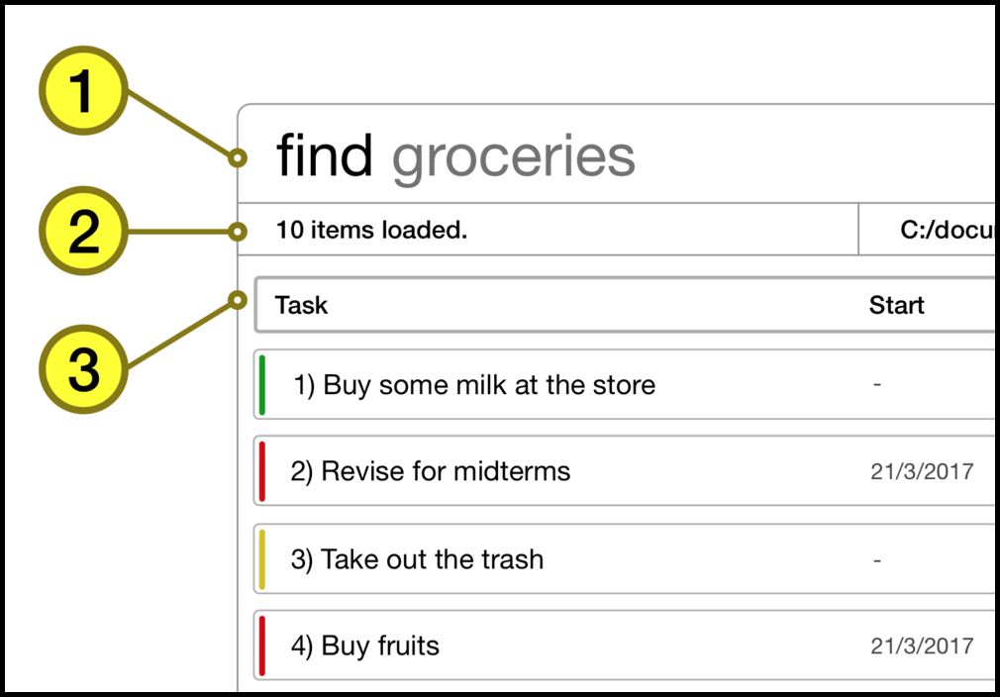

# User Guide

* [About](#about)
* [Quick Start](#quick-start)
    * [Installation Instructions](#installation-instructions)
    * [Launch](#launch)
    * [Visual Introduction](#visual-introduction) 
* [Features](#features)
* [Command Summary](#command-summary)
* [Frequently Asked Questions](#frequently-asked-questions)
 

## About
ezDo is the eziest™ way to get stuff done. Whether you’re planning a holiday, powering through your day or managing multiple work projects, ezDo is here to help you tick off all your personal and professional to-dos.

For an ez™ life, use ezDo™.

 

## Quick Start

### Installation Instructions

1. Ensure that you have [Java version `1.8.0_60`](http://www.oracle.com/technetwork/java/javase/downloads/jdk8-downloads-2133151.html) or later installed in your computer. 
2. Download the latest `ezDo.jar` from the [releases](../../../releases) tab. 

3. Copy the latest `ezDo.jar` to the folder you want to use. This folder will be the home folder for ezDo.

 

### Launch
To start the application, double-click on `ezDo.jar`. The user interface should appear in a few seconds. 

 

### Visual Introduction

#### 1. Command Box
Your commands should be typed here. 
#### 2. Description Box
The results of your command executions will be shown here. 
#### 3. Task Card
Each task in ezDo is represented by a taskcard with the following properties: 
* Each taskcard has an index on the left. 
* The color on the left indicates its priority.  
    * Green: low priority (1)
    * Orange: medium priority (2)
    * Red: high priority (3) 
* Taskcards may have a start/end time. 
* Taskcards may have any number of tags associated with it.

Now that we are familiar with ezDo's interface, let us get started with the features of ezDo!

 

## Features

**Things to note:**
* Words in `UPPER_CASE` are the parameters.
* Parameters in `SQUARE_BRACKETS` are optional.
* Parameters with `...` after them can have multiple instances (separated by a white space).

 

|Command|Description                                                |
|:-----:|:---------------------------------------------------------:|
|[add](#1-adding-a-task-add--a)             |Add a task             |
|[edit](#2-editing-a-task-edit--e)          |Edit a task            |
|[done](#3-marking-a-task-as-done-done--d)  |Mark a task as done    |
|[kill](#4-deleting-a-task-kill--k)         |Delete a task          |
|[sort](#5-sorting-a-list-of-tasks-sort--s) |Sort the list of tasks |
|[find](#6-finding-tasks-find--f)           |Search for a task      |
|[list](#7-listing-all-tasks-list--l)       |List the tasks         |
|[undo](#8-undoing-the-last-action-undo--u) |Revert the last action |
|[clear](#9-clearing-all-entries-clear--c)  |Delete all tasks       |
|[save](#10-moving-the-save-file-save)      |Save EzDo to a path    |
|[quit](#11-exiting-the-program-quit--q)    |Quit EzDo              |
|[help](#12-viewing-help-help--h)           |Show the user guide    |

 

### 1. Adding a task: `add / a`
---
Adds a task to ezDo. 
Format: 
**`add TASKNAME [p/PRIORITY] [s/STARTDATE] [d/DUEDATE] [t/TAGNAME1] [t/TAGNAME2]...`**
 
> - The task name must be inputted as the first parameter; all entries following the task name are optional. 
> - You can tag a task with any number of tags. 
> - The format for STARTDATE and DUEDATE, if required for a task, must be DD/MM/YYYY. 
> - Priority can be of any value between 1 and 3, with 1 being the lowest priority and 3 being the highest priority.

 

Examples: 
* You need to buy milk:
**`add Buy milk`**  
* You need to buy plane tickets to Hong Kong urgently:
**`add Buy plane tickets to Hong Kong p/3`**  
* You need to buy a table by 03/02/2017:
**`add Buy a table d/03/02/2017 t/watchingTV`**  
* You need to start marking CS2101 reflections on 01/03/2017:
**`add Mark CS2101 reflections s/01/03/2017  t/school`**  

 

### 2. Editing a task: `edit / e`
---
Edits a particular task by <u>specifying its index</u> and <u>its new information to be updated</u>. 
Format: 
**`edit INDEX [NEWTASKNAME] [p/NEWPRIORITY] [s/NEWSTARTDATE] [d/NEWDUEDATE] [t/NEWTAGNAME]...`**
 
> - If a task does not have any information in the specified field previously, the new information will be added to the field instead.  
> - To clear a field (except task name which cannot be cleared), type out the prefix but leave it blank.

 

Example:
    
You have just added this task to ezDo at index 1 with the Add command:

 **`add Buy milk p/1 t/NTUC`** 
 
You can now edit the task in several ways:

* You wish to change the task name:
**`edit 1 Buy milk and cereal`**  
* You wish to change the task's priority to 3:
**`edit 1 p/3`**  
* You wish to add a due date:
**`edit 1 d/05/07/2017`**

 

### 3. Marking a task as done: `done / d`
---
Marks the task at a specified index as done. 
Format: 
**`done INDEX`**
 
> - The index must be a positive integer.
> - The index refers to the index number of the tasks shown in the most recent listing.
> - Once a task at the specified index is marked as done, it will be removed from the task list and added to the done list.
> - You can view the done list with the command ______

 

Example:
* Marks the task at index 3 as done:
**`done 3`**  

 

### 4. Deleting a task: `kill / k`
---
Marks the task at a specified index as deleted. 
Format: 
**`kill INDEX`**
 
> - The index must be a positive integer.
> - The index refers to the index number of the tasks shown in the most recent listing.
> - Once a task at the specified index is deleted, it will be removed from the task list.

 

Example:
* Deletes the task at index 3:
**`kill 3`**  

 

### 5. Sorting a list of tasks: `sort / s`
---

Sorts the list of tasks according to the specified ordertype lexicographically. 
Format: 
**`sort ORDERTYPE`**
 
> `ORDERTYPE` can be any of the following:
> - n - name
> - p - priority
> - s - start date 
> - d - due date 

 

Example:

You have just added a few tasks to ezDo with the Add command:

 **`add Dye hair p/3 s/06/05/2017 d/07/08/2017`** 
 **`add Buy milk p/1 s/04/05/2017 d/09/06/2017`** 
 **`add Cut hair p/2 s/05/05/2017 d/08/07/2017`**

You can now sort the tasks by name:

 

### 6. Finding tasks: `find / f`
---
Finds tasks whose information contains any of the given keywords specified by its prefix.  
Format: 
**`find [KEYWORD] [MORE_KEYWORDS] [p/PRIORITY] [s/STARTDATE] [d/DUEDATE] [t/TAGNAME1] [t/TAGNAME2]...`**
 
> - At least one field is needed to search.
> - The search is case insensitive. 
> e.g. `find Milk` will match the task with the name `milk`.  
> - The order of the keywords does not matter.
> e.g. `find Buy Milk` will match the task with the name `Milk Buy`.  
> - Only full words will be matched. 
> e.g. `find Milk` will not match the task with the name `Milks`.  
> - Only tasks matching all keywords will be returned.
    e.g. `find Milk p/1` will not match with the task `Buy Milk` with priority of 2.
    e.g. `find donuts milk` will match the task with the name `Buy donuts and milk`. 
> - After finding your task, type `list` to go back to the default view.

 

Examples:
*  You can find tasks that have a due date on `20/03/2017`:
**`find d/20/03/2017`**  
*  You can find tasks containing `Buy`, `The`, and `Milk`:
**`find Buy The Milk`**  
*  You can find tasks containing `School` with a priority of `1`:
**`find School p/1`**  

 

### 7. Listing all tasks: `list / l`
---
Lists all the tasks in ezDo.  
Format:
**`list`**

 

### 8. Reverts the command: `undo / u`
---
Reverts the last command.  
Format: 
**`undo`**
 
> - You can only undo the following commands - `add/edit/kill/clear/sort`.
> - You cannot use the command `undo` consecutively.

 

Example:
*  You just deleted the task: `buy milk` but you can restore it to the task list with the command - `undo`
   

 

### 9. Clearing all entries: `clear / c`
---
Clears all entries from ezDo.  
Format: 
**`clear`**
 
> - User will be prompted with clear confirmation.

 

### 10. Moving the save file: `save`
---
Moves the save file of ezDo to a specified directory.  
Format: 
**`save DIRECTORY`**
 
> - The directory specified must be valid.
> - to add more

 

Example:
* Moves the save file of ezDo to `C:\Desktop`:
**`save C:\Desktop`**  

 

### 11. Exiting the program: `quit / q`
---
Exits the program.  
Format:
**`quit`**
 
> - There will be no exit confirmation!

 

### 12. Viewing help: `help / h`
---
Brings up the help guide in a separate window.  
Format:
**`help`**
 
> - The help guide is also shown if you enter an invalid command e.g. **`kill 1`**

 

## Frequently Asked Questions

**Question: How do I transfer my data to another computer?**  
**Answer**: Install the app in the other computer and overwrite the empty data file it creates with the file that contains the data of your previous ezDo.
 

**Question: How do I save my ezDo tasks?**  
**Answer**: ezDo data is saved in the hard disk automatically after any command that changes the data. There is no need to save manually.
 

## Command Summary

|Command|Description                                                |
|:-----:|---------------------------------------------------------|
|[add](#1-adding-a-task-add--a)             |**`add TASKNAME [p/PRIORITY] [s/STARTDATE] [d/DUEDATE] [t/TAGNAME]...`**             |
|[edit](#2-editing-a-task-edit--e)          |**`edit INDEX [NEWTASKNAME] [p/NEWPRIORITY] [s/NEWSTARTDATE] [d/NEWDUEDATE] [t/NEWTAGNAME...]`**            |
|[done](#3-marking-a-task-as-done-done--d)  |**`done INDEX`**    |
|[kill](#4-deleting-a-task-kill--k)         |**`kill INDEX`**          |
|[sort](#5-sorting-a-list-of-tasks-sort--s) |**`sort ORDERTYPE`** |
|[find](#6-finding-tasks-find--f)           |**`find [KEYWORD] [MORE_KEYWORDS] [p/PRIORITY] [s/STARTDATE] [d/DUEDATE] [t/TAGNAME]`**      |
|[list](#7-listing-all-tasks-list--l)       |**`list`**         |
|[undo](#8-undoing-the-last-action-undo--u) |**`undo`** |
|[clear](#9-clearing-all-entries-clear--c)  |**`clear`**       |
|[save](#10-moving-the-save-file-save)      |**`save DIRECTORY`**    |
|[quit](#11-exiting-the-program-quit--q)    |**`quit`**              |
|[help](#12-viewing-help-help--h)           |**`help`**    |
