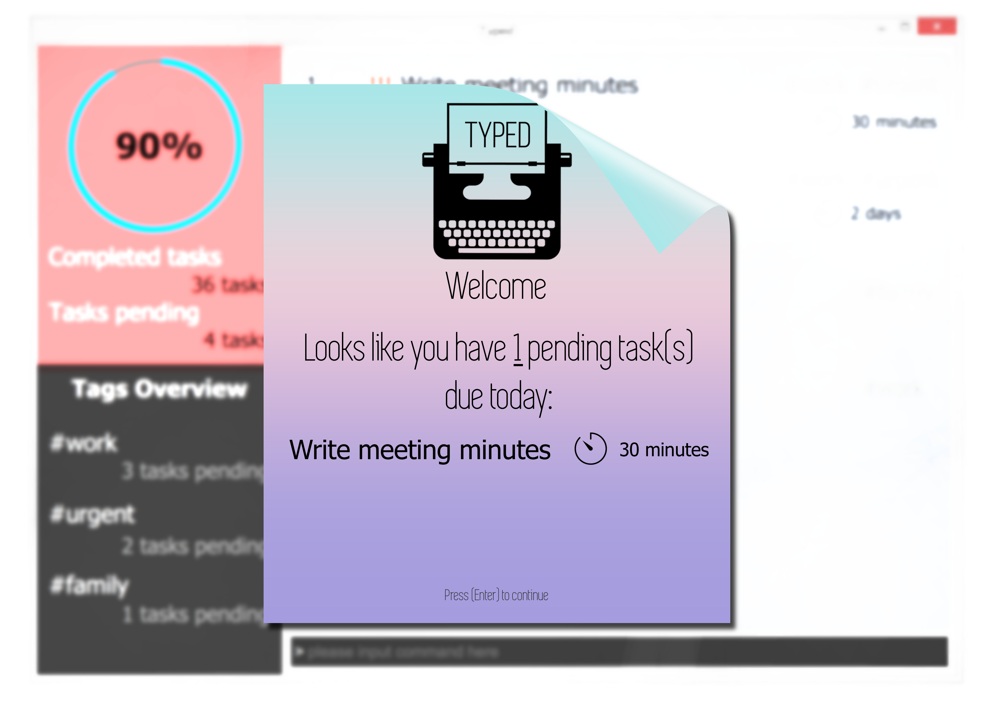
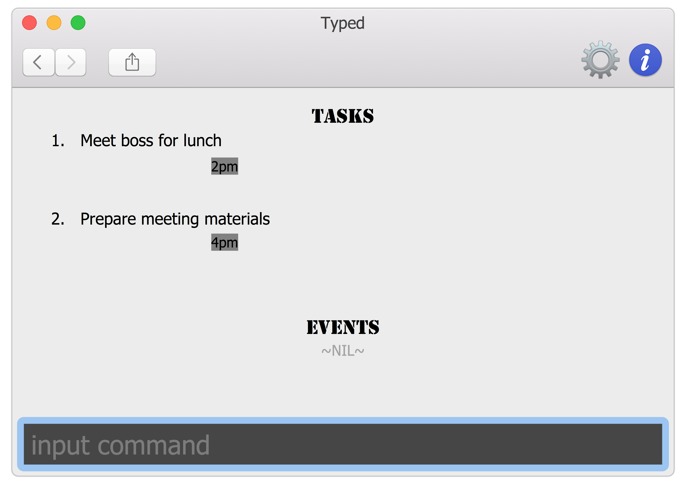

# Typed - User Guide

By : `Typedwriters`  &nbsp;&nbsp;&nbsp;&nbsp; Since: `March 2017`  &nbsp;&nbsp;&nbsp;&nbsp; Licence: `MIT`

---

1. [Getting Started](#getting-started)
2. [Returning to *Typed*](#returning-to-typed)
3. [Features](#features)
4. [Command Summary](#command-summary)
5. [FAQ](#faq)

## 1. Getting Started

Before you setup *Typed*, you should have Java version `1.8.0_60` or later installed.  

1. Download the latest `typed.jar` from the [releases](../../../releases) tab. 
2. Copy the file to the folder you want to use as *Typed*'s new home.
3. Press the Ctrl+Shift+T key to launch the app. *Typed* will welcome you in a few seconds.
      
4. Walk through the tutorial to try out basic features, or experiment with **[Features](#features)** below. 

## 2. Returning to *Typed*

*Typed* is always happy to see you again.  

1. Forget the tutorial, *Typed* is ready for a productive day! You will be greeted with a view of today's focus. This view includes events happening today, overdue tasks and tasks due today. 
2. Let *Typed* know when you are ready to start work by pressing <kbd>Enter</kbd>. 
      
3. This will bring you to the default view, where tasks and events are sorted by deadlines. 
      

## 2. Features #TODO: fix

> **Command Format**
>
> * Words in `UPPER_CASE` are the parameters.
> * Words in `lower_case` are the exact strings.
> * Items in `SQUARE_BRACKETS` are optional.
> * Items with `|` indicates either or field.
> * Items with `...` after them can have multiple instances.

### 2.1. Viewing help : `help`

Format: `help [COMMAND]`

> `help [COMMAND]` shows a more detailed explanation of the command e.g. `help add`  
> Help is also shown if you enter an incorrect command e.g. `abcd`

### 2.2. Adding a task or event: `add`

Adds a task or event to Typed 
Format: `add TASK [by|every|from|now] [DATE] [to] [DATE] [#/TAGS]...`

> Tasks and events can have any number of tags (including 0)

Examples:

* `add read the little prince`
* `add training camp from 2 May to 5 May`

### 2.3. Listing all persons : `list`

Shows a list of the tasks and events in Typed. 
Format: `list [TYPE]`

Examples:

* `list all`
* `list undone`

### 2.4. Editing a person : `edit`

Edits an task or event in Typed. 
Format: `edit INDEX [DESCRIPTION] [by] DATE | DAY | TIME] [+TAGS | -TAGS]`

> * Edits the person at the specified `INDEX`.
    The index refers to the index number shown on the screen. 
    The index **must be a positive integer** 1, 2, 3, ...
> * At least one of the optional fields must be provided.
> * Existing values will be updated to the input values.
> * When editing tags, the user can only remove or add tags.
> * You can remove all tags by typing `t/` without specifying any tags after it.

Examples:

* `edit 1 by following Sunday` 
  Edits the deadline of the task to the following Sunday.

* `edit 5 + #work` 
  Adds a tag #work to index 5 of the shown list on the screen.

### 2.5. Finding all tasks containing any keyword in their name: `find`

Finds tasks and events whose names contain any or close to the given keywords. 
Format: `find KEYWORD|TAGS [MORE_KEYWORDS | MORE_TAGS]`

> * The search is not case sensitive. e.g `boss` will match `Boss`
> * The order of the keywords does not matter. e.g. `Hans Bo` will match `Bo Hans`
> * Only the name of the tasks and events is searched.
> * Fuzzy find is used e.g. `bss` will match `boss`
> * Tasks or events matching at least one keyword will be returned (i.e. `OR` search).
    e.g. `Expo` will match `IT Expo`

Examples:

* `find johnny depp` 
  Returns any tasks and events that names have close to the keywords, johnny and depp
* `find boss #work` 
  Returns any tasks or events with similar words to boss or contains similar tagging to work.

### 2.6. Deleting a person : `delete`

Deletes the specified person from the address book. Irreversible. 
Format: `delete INDEX`

> Deletes the person at the specified `INDEX`.  
> The index refers to the index number shown in the most recent listing. 
> The index **must be a positive integer** 1, 2, 3, ...

Examples:

* `list` 
  `delete 2` 
  Deletes the 2nd person in the address book.
* `find Betsy` 
  `delete 1` 
  Deletes the 1st person in the results of the `find` command.

### 2.7. Select a person : `select`

Selects the person identified by the index number used in the last person listing. 
Format: `select INDEX`

> Selects the person and loads the Google search page the person at the specified `INDEX`. 
> The index refers to the index number shown in the most recent listing. 
> The index **must be a positive integer** 1, 2, 3, ...

Examples:

* `list` 
  `select 2` 
  Selects the 2nd person in the address book.
* `find Betsy`  
  `select 1` 
  Selects the 1st person in the results of the `find` command.

### 2.8. Clearing all entries : `clear`

Clears all entries from the address book. 
Format: `clear`

### 2.9. Exiting the program : `exit`

Exits the program. 
Format: `exit`

### 2.10. Saving the data : `exit`

Address book data are saved in the hard disk automatically after any command that changes the data. 
There is no need to save manually, unless you would like to save to a new file.

Saves the data in a new file. 
Format: `save FILENAME`

## 3. Command Summary
 
* **Add**  `add TASK [by|every|from|on] [date] [to] [date] [#/tags]...` #TODO: fix   
  e.g. `add read the little prince`  
  e.g. `add push git commit by next wednesday`  
  e.g. `add write blog post every day #/hobby`  
  e.g. `add meet boss every monday`  
  e.g. `add release paycheck every month`  
  e.g. `add my birthday every year`  
  e.g. `add training camp from 2 May to 5 May`  
  e.g. `add drinks with client tomorrow from 1PM to 2PM`  
  e.g. `add clean room on Sunday`  

* **Complete**  `complete INDEX [all|to|,] [INDEX] ...` #TODO: fix  
  e.g. `complete 2`  
  e.g. `complete 2 to 10`  
  e.g. `complete 1,3,5`  
  e.g. `complete 1, 3, 5 to 10`  
  e.g. `complete all`  

* **Delete** : `delete INDEX [all|to|,] [INDEX] ...` #TODO: fix  
  e.g. `delete 2`  
  e.g. `delete 2 to 10`  
  e.g. `delete 1,3,5`  
  e.g. `delete 1, 3, 5 to 10`  
  e.g. `delete all`  

* **Edit** : `edit INDEX ...` #TODO: fix  
  e.g. `edit 1 by following Saturday`  
  e.g. `edit 2 on 2 May`  
  e.g. `edit 4 from 13:00 to 5pm`  
  e.g. `edit 3 every Wednesday`  
  e.g. `edit 7 play mousehunt`  
  e.g. `edit 5 +#work`  
  e.g. `edit 6 -#supplier`  

* **Find** : `find KEYWORD|TAG [MORE_KEYWORDS|MORE_TAGS] ...`   
  e.g. `find johnny depp`  
  e.g. `find boss #work`  
  e.g. `find #forever #alone`  
  
* **Help** : `help`  
  e.g. help  
  
* **History** : `history`  
  e.g. `history`  
  
* **List** : `list TYPE`  
  e.g. `list`  
  e.g. `list all`  
  e.g. `list undone`  
  e.g. `list done`  
  e.g. `list events`  

* **Redo** : `redo [INDEX|all]` #TODO: fix  
  e.g.`redo`  
  e.g.`redo 5`  
  e.g.`redo all`  

* **Save** : `save FILENAME`  
  e.g.`save newfile.txt`  
  
* **Quit** : `quit`  
  e.g.`quit`  
  
* **Undo** : `undo [INDEX|all]` #TODO: fix  
  e.g.`undo`  
  e.g.`undo 5`  
  e.g.`undo all`  

## 4. FAQ

**Q**: How do I transfer my data to another Computer? 
**A**: Install the app in the other computer and overwrite the empty data file it creates with
       the file that contains the data of your previous Typed folder.
       
**Q**: How do I backup my data to another location? 
**A**: Copy the saved Typed file to any desired location of your choice. Alternatively, 
       use our in-built backup feature as described in the [Features](#features) section above. 
       
**Q**: Is my personal data and information kept secure from the eyes of others (including the dev team)? 
**A**: Yes! Everything you enter into Typed is only stored on your local machine in your specified storage file. 
