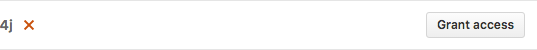
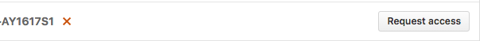

# AppVeyor
 

[AppVeyor](https://www.appveyor.com/) is a _Continuous Integration_ platform for GitHub projects.
It runs its builds on Windows virtual machines.

AppVeyor can run the project's tests automatically whenever new code is pushed to the repo.
This ensures that existing functionality and features have not been broken on Windows by the changes.

The current AppVeyor setup performs the following things whenever someone pushes code to the repo:

* Runs the `gradlew.bat headless allTests` command.

* Automatically re-tries the build up to 3 times if a task fails.

If you would like to customize your AppVeyor build further, you can learn more about AppVeyor from the
[AppVeyor Documentation](https://www.appveyor.com/docs/).

  

## Setting up AppVeyor
 

1. From [this repository](https://github.com/CS2103JAN2017-W14-B4/main), ___fork___ and ___clone___ it to your computer.  

2. Go to https://ci.appveyor.com/. Under `Login`, click on `GitHub` to login with your GitHub account (as shown in Figure 1).
   Enter your GitHub account details if needed.  
   
   

   <h5 align="center">Figure 1: "GitHub" Button in AppVeyor</h5>
 

3. After logging in, you will be brought to your projects dashboard. Click on `NEW PROJECT` (as shown in Figure 2).  
   

   <h5 align="center">Figure 2: "New Project" Button in AppVeyor</h5>
 

4. You will be brought to the `Select repository` page. Select `GitHub` (as shown in Figure 3).  

    * On your first usage of AppVeyor, you will need to give AppVeyor authorization to your GitHub account. Click on `Authorize GitHub`.        

    <h5 align="center">Figure 3: "GitHub" and "Authorise GitHub" Button in AppVeyor</h5> 
    
    * This will bring you to a GitHub page that manages the access of third-party applications to your repositories. Depending on whether you are the owner of the repository, you can click either one of the following:  

        - Grant access (as shown in Figure 4):  
           

           <h5 align="center">Figure 4: Grant Access Button</h5> 
        - Request access (as shown in Figure 5):  
           

           <h5 align="center">Figure 5: Request Access Button</h5> 

5. AppVeyor will then list the repositories you have access to in your GitHub account.
   Find the repository you want to set AppVeyor up on, and then click `ADD` (as shown in Figure 6).  
   

   <h5 align="center">Figure 6: "Add" Button in AppVeyor</h5> 

6. AppVeyor will then be activated on that repository.
   To see the CI in action, push a commit to any branch!  

    * Go to the repository and see the pushed commit. There should be an icon which will link you to the AppVeyor build (as shown in Figure 7):  

   

   <h5 align="center">Figure 7: Screenshot of Appveyor Build</h5> 

    * As the build is run on a remote machine, we can only examine the logs it produces (as shown in Figure 8):  

   

<h5 align="center">Figure 8: Screenshot of Appveyor Build Logs</h5>
 

7. Update the link to the "build status" badge at the top of `README.md` to point to the AppVeyor build status of your own repo.

    * To find your build status badge URL,
      first go to your project settings by clicking on the "Settings" icon (as shown in Figure 9):  

    

<h5 align="center">Figure 9: Project Settings Icon in AppVeyor</h5> 

    * Then go to the `Badges` section of your project settings by clicking on it (as shown in Figure 10):  

        

        <h5 align="center">Figure 10: Badges Link in AppVeyor Settings Page</h5> 

    * Then copy and paste the markdown code for your `master` branch to your `README.md` file (as shown in Figure 11):  

        

        <h5 align="center">Figure 11: Branch Sample MarkDown Code Field</h5> 
