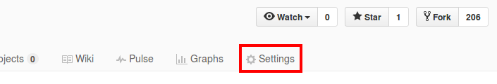

# Using GitHub Pages
 

[GitHub Pages](https://pages.github.com/) is a static site hosting service that allows users to publish
webpages using files in their GitHub repositories.

  

## Setting Up
 

GitHub Pages offers two kinds of sites: user/organization sites and project sites.
Since we are using GitHub Pages to showcase the documentation for our project, we will be creating a project site.

 1. Navigate to the repository's `Settings` tab in GitHub (as shown in Figure 1).   
    

<h5 align="center">Figure 1: Settings tab in GitHub</h5>
 

 2. Under the GitHub Pages section, click `Choose a theme` in `Theme chooser`. Pick a theme for the project site and click `Select theme` when done.
 

 3. You can now view the site at `https://<username-or-organization-name>.github.io/<repo-name>`.  
    e.g. `https://cs2103jan2017-w14-b4.github.io/main`
     

Note that the publishing source has been automatically set to `master branch`.
This means that the GitHub Pages site will be published using source files in the `master` branch.
Jekyll, a static site generator integrated with GitHub Pages, automatically renders Markdown files
(in the `master` branch) to HTML, which are then deployed to the project site by GitHub Pages.

  

## Viewing the Project Site
 

The project site URL follows the format `https://<username-or-organization-name>.github.io/<repo-name>`,
e.g. `https://cs2103jan2017-w14-b4.github.io/main`.
By default, the [README](../README.md) file is displayed on this page.
 

The structure of the site follows the structure of the repository for the other pages.  
For example: `docs/UserGuide.md` is published at `https://cs2103jan2017-w14-b4.github.io/main/docs/UserGuide.html`.

  

## Updating the Project Site
 

To update the project site, simply edit the documentation files in Markdown and push the changes to GitHub.
GitHub Pages automatically updates the project site when changes are committed to the `master` branch
(e.g. when the commit is pushed to the `master` branch or when the pull request containing the commit is
merged into `master`).

  

## Customizing the Project Site
 

Refer to [GitHub's guides](https://help.github.com/categories/customizing-github-pages/) for instructions on customizing the project site.

  

## Troubleshooting
 

 **Problem: Markdown is not displayed properly in GitHub Pages even though they appear correctly in GitHub preview.**
   

 * **Reason:** Jekyll (which converts Markdown to HTML for GitHub Pages) uses kramdown as its markdown engine but
   GitHub preview uses GitHub's own markdown engine. Since kramdown requires stricter syntax than GitHub's markdown
   engine, a Markdown file might be rendered correctly in GitHub preview but not on GitHub Pages.  
 * **Solution:** Make sure you have followed the [coding standard](https://oss-generic.github.io/process/codingStandards/CodingStandard-Gfmd.html)
   for GitHub Flavored Markdown. If the problem persists, try checking [kramdown's syntax](https://kramdown.gettalong.org/parser/gfm.html)
   to see if you are using the correct syntax for GitHub Pages. 
