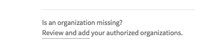
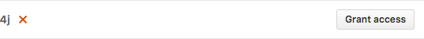
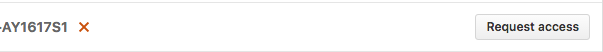
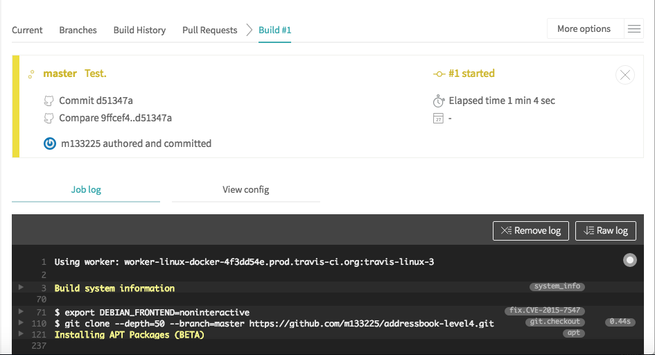

# Travis CI
<br>

[Travis CI](https://travis-ci.org/) is a _Continuous Integration_ platform for GitHub projects.

Travis CI can run the projects' tests automatically whenever new code is pushed to the repo.
This ensures that existing functionality and features have not been broken by the changes.

The current Travis CI set up performs the following things whenever someone push code to the repo:

* Runs the `./gradlew clean headless allTests coverage coveralls -i` command
(see [UsingGradle.md](UsingGradle.md) for more details on what this command means).
* Automatically retries the build up to 3 times if a task fails.
* Runs additional [repository-wide checks](#repository-wide-checks).

If you would like to customise your travis build further, you can learn more about Travis
from [Travis CI Documentation](https://docs.travis-ci.com/).

<br>

## Setting up Travis CI

1. From [this repository](https://github.com/CS2103JAN2017-W14-B4/main), ___fork___ and ___clone___ it to your computer.<br><br>

2. Go to https://travis-ci.org/ and click `Sign in with GitHub` as shown in Figure 1, then enter your GitHub account details if needed.<br><br>
<p align="center"></p><br>
<h5 align="center">Figure 1: Sign in with GitHub button on Travis Website</h5><br>

3. Head to the [Accounts](https://travis-ci.org/profile) page, and find the switch for the forked repository.<br><br>
    * If the organization is not shown, click `Review and add` as shown in Figure 2: <br><br>
      <p align="center"></p>
      <h5 align="center">Figure 2: Review and Add Link</h5>
      This should bring you to a GitHub page that manages the access of third-party applications. Depending on whether you are the owner of the repository, you can either do one of the following to Travis CI so that it can access your commits and build your code:<br>
        - Grant access (as shown in Figure 3)<br><br>
                  <p align="center"></p>
      <h5 align="center">Figure 3: Grant Access Button</h5><br>
        - Request access (as shown in Figure 4)<br><br>
                  <p align="center"></p>
      <h5 align="center">Figure 4: Request Access Button</h5><br>
    * If repository cannot be found, click `Sync account`.<br><br>
4. Activate the switch (as shown in Figure 5).<br><br>
   <p align="center"></p>
      <h5 align="center">Figure 5: Repository Switch</h5><br>
5. This repo comes with a [`.travis.yml`](../.travis.yml) that tells Travis what to do, so there is no need for you to create one yourself.<br><br>
6. To see the CI in action, push a commit to the master branch!<br><br>
    * Go to the repository and see the pushed commit. There should be an icon which will link you to the Travis build (as shown in Figure 6).<br><br>
      <p align="center"></p>
      <h5 align="center">Figure 6: Screenshot Showing the Pushed Commit and Travis Build Icon </h5><br>
    * As the build is run on a provided remote machine, we can only examine the logs it produces (as shown in Figure 7):<br><br>
      <p align="center"></p>
      <h5 align="center">Figure 7: Screenshot Showing the Travis Build </h5><br>
7. If the build is successful, you should be able to check the coverage details of the tests at [Coveralls](http://coveralls.io/).<br><br>
8. Update the link to the 'build status' badge at the top of the `README.md` to point to the build status of your own repo.<br><br>

<br>

## Repository-wide checks
<br>
In addition to running Gradle checks, we also configure Travis CI to run some repository-wide checks.
Unlike the Gradle checks which only cover files used in the build process, these repository-wide checks cover *all* files in the repository.
They check for repository rules which are hard to enforce on development machines such as
line ending requirements.

These checks are implemented as POSIX shell scripts, and thus can only be run on POSIX-compliant operating systems such as macOS and Linux.
To run all checks locally on these operating systems, execute the following in the repository root directory:
```shell
./config/travis/run-checks.sh
```
Any warnings or errors will be printed out to the console.

<br>

### Implementing new checks

Checks are implemented as executable `check-*` scripts within the `config/travis/` directory.
The `run-checks.sh` script will automatically pick up and run files named as such.

Check scripts should print out errors in the following format:
```
SEVERITY:FILENAME:LINE: MESSAGE
```
where
* `SEVERITY` is either `ERROR` or `WARN`,
* `FILENAME` is the path to the file relative to the current directory,
* `LINE` is the line of the file where the error occurred
* `MESSAGE` is the message explaining the error.

Check scripts must exit with a non-zero exit code if any errors occur.
